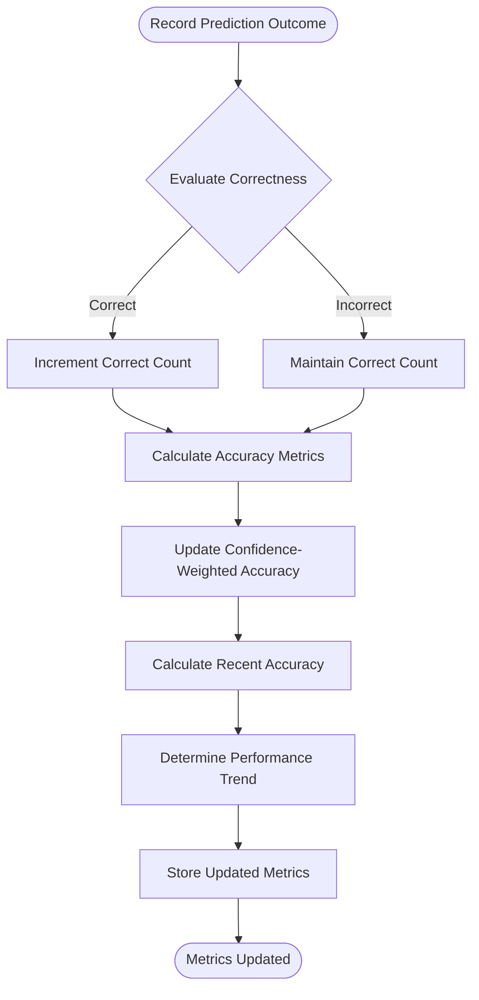

# Performance Monitoring

<cite>
**Referenced Files in This Document**   
- [learning_coordinator.py](file://src/ml/learning_coordinator.py)
- [accuracy_tracker.py](file://src/ml/performance_tracking/accuracy_tracker.py)
- [022_performance_analytics_schema.sql](file://supabase/migrations/022_performance_analytics_schema.sql)
</cite>

## Table of Contents
1. [Introduction](#introduction)
2. [Performance Tracking Implementation](#performance-tracking-implementation)
3. [Accuracy Metrics and Calculation Methods](#accuracy-metrics-and-calculation-methods)
4. [Database Schema and Indexing Strategy](#database-schema-and-indexing-strategy)
5. [Handling Cold-Start and Sparse Data](#handling-cold-start-and-sparse-data)
6. [Configuration Options and Thresholds](#configuration-options-and-thresholds)
7. [Conclusion](#conclusion)

## Introduction
The performance monitoring system within the self-healing NFL prediction framework is designed to track and analyze expert prediction accuracy in real-time. This sub-feature enables the system to dynamically adjust expert weights, detect performance degradation, and trigger belief revisions when accuracy declines. The LearningCoordinator class serves as the central component for tracking expert performance metrics, including overall accuracy, confidence-weighted accuracy, and recent performance trends across different prediction categories. By continuously monitoring these metrics, the system can identify underperforming experts, adapt to changing conditions, and maintain high prediction quality over time.

## Performance Tracking Implementation
The LearningCoordinator class implements comprehensive performance tracking by recording prediction outcomes and updating expert metrics in real-time. When a prediction outcome is recorded via the `record_prediction_outcome` method, the system evaluates correctness based on prediction type (moneyline, spread, or total) using appropriate tolerance thresholds. For each outcome, the system updates the expert's performance statistics, including total predictions, correct predictions, and various accuracy metrics.

The system maintains a rolling history of the last 1000 predictions in a deque structure, enabling trend analysis over recent performance. After each prediction outcome, the `_update_expert_performance` method recalculates key metrics such as overall accuracy, confidence-weighted accuracy, and recent accuracy (based on the last 10 predictions). The trend analysis compares performance in the first and second halves of recent predictions to determine if an expert is improving, declining, or stable.

The AccuracyTracker class complements this functionality by providing category-specific accuracy tracking. It maintains separate accuracy profiles for different prediction categories (winner_prediction, against_the_spread, totals_over_under, etc.) and calculates specialized correctness criteria for each category. For example, exact score predictions are considered correct if within 3 points, while margin of victory predictions allow a 7-point tolerance.

**Section sources**
- [learning_coordinator.py](file://src/ml/learning_coordinator.py#L99-L749)
- [accuracy_tracker.py](file://src/ml/performance_tracking/accuracy_tracker.py#L70-L614)

## Accuracy Metrics and Calculation Methods
The system calculates several accuracy metrics to provide a comprehensive view of expert performance:

**Overall Accuracy**: Calculated as the ratio of correct predictions to total predictions. This provides a straightforward measure of an expert's success rate.

**Confidence-Weighted Accuracy**: This metric incorporates prediction confidence into the accuracy calculation. It uses a running average formula: `old_weighted_acc * 0.9 + weighted_correct * weight * 0.1`, where weighted_correct is 1.0 for correct predictions and 0.0 for incorrect ones. This gives more weight to high-confidence predictions while maintaining stability.

**Recent Accuracy**: Calculated over the last 10 predictions, this metric provides insight into current form and short-term performance trends.

**Category-Specific Accuracy**: The AccuracyTracker maintains separate accuracy calculations for each prediction category, using category-appropriate correctness criteria. For example:
- Categorical predictions (winner, spread direction) require exact matches
- Exact score predictions allow a 3-point tolerance
- Margin of victory predictions allow a 7-point tolerance
- Yardage predictions are correct if within 20% or 25 yards
- Count statistics (touchdowns, receptions) are correct if within 1 count

The system also calculates a confidence calibration score by dividing predictions into 10 confidence bins and measuring the difference between average confidence and actual accuracy in each bin. A lower calibration error indicates better-calibrated confidence estimates.

**Diagram sources**
- [learning_coordinator.py](file://src/ml/learning_coordinator.py#L99-L749)
- [accuracy_tracker.py](file://src/ml/performance_tracking/accuracy_tracker.py#L70-L614)

**Section sources**
- [learning_coordinator.py](file://src/ml/learning_coordinator.py#L99-L749)
- [accuracy_tracker.py](file://src/ml/performance_tracking/accuracy_tracker.py#L70-L614)

## Database Schema and Indexing Strategy
The performance analytics system uses a comprehensive database schema to store and analyze expert performance data. The primary table, `expert_performance`, stores key metrics for each expert including total predictions, correct predictions, accuracy, confidence-weighted accuracy, recent accuracy, trend, weight, and confidence score. This table is indexed on `expert_id` to enable efficient lookups.

The `prediction_outcomes` table records detailed information about each prediction, including prediction_id, expert_id, game_id, prediction_type, predicted_value, confidence, actual_value, was_correct, error_magnitude, timestamp, and context. This table has indexes on both `expert_id` and `game_id` to support queries by expert or by game.

For more advanced analytics, the system implements a comprehensive schema in the `022_performance_analytics_schema.sql` migration. This includes specialized tables for:
- `accuracy_tracking_detailed`: Multi-dimensional accuracy tracking with category-specific metrics
- `performance_trend_analysis`: Statistical trend detection and projection
- `category_performance_analysis`: Category-specific performance analysis
- `confidence_calibration_analysis`: Confidence calibration metrics by confidence bins

These tables use UUID primary keys and include comprehensive indexes to support efficient querying. For example, the accuracy tracking table has indexes on expert_id with tracking period, overall accuracy, trend direction, and Brier score. The trend analysis table is indexed on expert_id with analysis date, trend direction, and statistical significance.

The system also includes materialized views like `realtime_expert_performance` and `category_performance_leaderboard` that provide optimized access to performance data for dashboard displays.

**Section sources**
- [022_performance_analytics_schema.sql](file://supabase/migrations/022_performance_analytics_schema.sql#L1-L476)
- [learning_coordinator.py](file://src/ml/learning_coordinator.py#L99-L749)

## Handling Cold-Start and Sparse Data
The system implements several strategies to handle cold-start scenarios for new experts and sparse prediction data:

When a new expert is registered via the `register_expert` method, it is initialized with neutral performance metrics: 0.5 accuracy, 0.5 confidence-weighted accuracy, and 0.5 recent accuracy. This prevents new experts from being immediately penalized while they accumulate prediction history.

The system requires a minimum number of predictions before certain metrics are calculated. For example, trend analysis requires at least 5 recent predictions, and confidence calibration requires at least 5 predictions per confidence bin. This prevents unreliable trend detection from sparse data.

For experts with limited prediction history, the system uses conservative default values. The `revision_threshold` is set to 0.3, meaning belief revision is only triggered when recent accuracy drops below 30%, which helps prevent overreaction to small sample sizes.

The AccuracyTracker class implements similar safeguards, requiring a minimum of 5 predictions in a category before including an expert in category leaderboards. This ensures that performance rankings are based on statistically significant sample sizes.

The system also uses exponential smoothing for confidence-weighted accuracy, which gives more weight to recent performance while maintaining stability from historical data. This allows new experts to establish their performance profile without being overly influenced by their initial predictions.

**Section sources**
- [learning_coordinator.py](file://src/ml/learning_coordinator.py#L99-L749)
- [accuracy_tracker.py](file://src/ml/performance_tracking/accuracy_tracker.py#L70-L614)

## Configuration Options and Thresholds
The performance monitoring system provides several configurable parameters to control its behavior:

**Performance Thresholds**:
- `weight_update_threshold`: Set to 0.1, triggers weight updates when accuracy changes by 10%
- `revision_threshold`: Set to 0.3, triggers belief revision when recent accuracy drops below 30%
- `memory_update_frequency`: Set to 5, updates episodic memory every 5 predictions

**Accuracy Calculation Methods**:
- Tolerance values for different prediction types:
  - Spread predictions: 3.0 point tolerance
  - Total predictions: 7.0 point tolerance
  - Exact score predictions: 3 point tolerance
  - Margin of victory: 7 point tolerance
  - Yardage predictions: 20% or 25 yard tolerance

**Data Retention Policies**:
- Prediction history: Maintains last 1000 predictions in memory
- Learning events: Maintains last 500 events in memory
- Database retention: Controlled by external cleanup processes

**AccuracyTracker Configuration**:
- `recent_window_size`: 20 predictions for recent accuracy calculation
- `calibration_bins