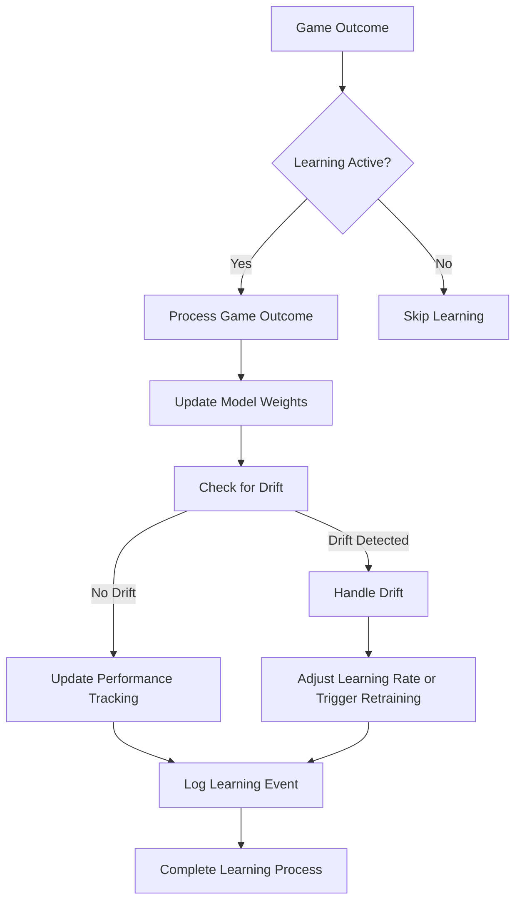
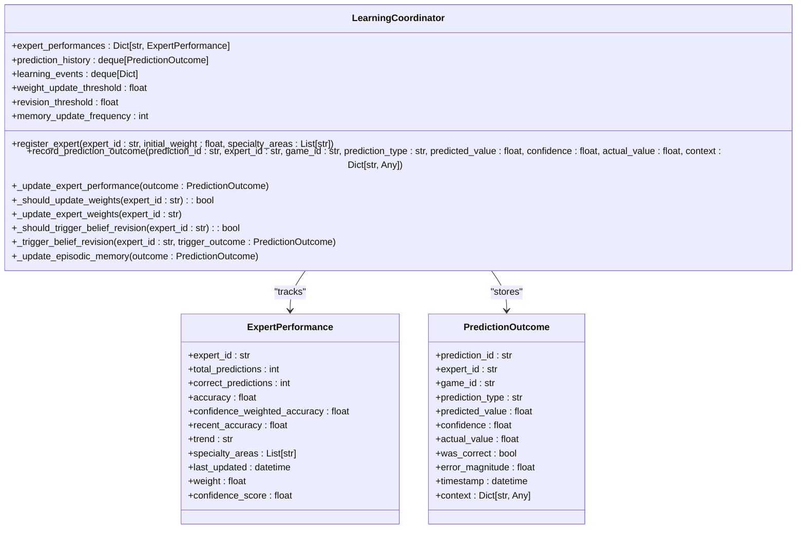

<docs>
# Self-Healing System

<cite>
**Referenced Files in This Document**   
- [continuous_learner.py](file://src/ml/continuous_learner.py)
- [learning_coordinator.py](file://src/ml/learning_coordinator.py)
- [adaptation_engine.py](file://src/ml/self_healing/adaptation_engine.py)
- [performance_decline_detector.py](file://src/ml/self_healing/performance_decline_detector.py)
- [learning_pipeline_integration.py](file://src/ml/learning_pipeline_integration.py)
- [023_self_healing_system_schema.sql](file://supabase/migrations/023_self_healing_system_schema.sql)
- [demo_two_game_learning.py](file://scripts/demo_two_game_learning.py) - *Updated in recent commit*
- [enhanced_llm_expert.py](file://src/ml/enhanced_llm_expert.py) - *Updated in recent commit*
- [adaptive_learning_engine.py](file://src/ml/adaptive_learning_engine.py) - *Added in recent commit*
</cite>

## Update Summary
**Changes Made**   
- Added new section on Gradient Descent Learning Implementation to document the new adaptive learning engine
- Added new section on Self-Reflection Learning Demonstration to showcase the two-game learning demo
- Updated Introduction to include gradient descent and self-reflection capabilities
- Added new diagram showing the gradient descent learning process
- Updated referenced files to include newly added and modified files
- Enhanced source tracking with annotations for updated and new files

## Table of Contents
1. [Introduction](#introduction)
2. [Continuous Learning System](#continuous-learning-system)
3. [Learning Coordinator](#learning-coordinator)
4. [Performance Decline Detection](#performance-decline-detection)
5. [Adaptation Engine](#adaptation-engine)
6. [Learning Cycles and Feedback Loops](#learning-cycles-and-feedback-loops)
7. [Configuration and Thresholds](#configuration-and-thresholds)
8. [System Integration](#system-integration)
9. [Gradient Descent Learning Implementation](#gradient-descent-learning-implementation)
10. [Self-Reflection Learning Demonstration](#self-reflection-learning-demonstration)
11. [Conclusion](#conclusion)

## Introduction
The NFL Predictor API features a sophisticated self-healing system that enables continuous learning and automatic adaptation based on real game outcomes. This system ensures long-term prediction reliability by automatically updating models and expert weights, detecting performance degradation, and triggering retraining processes. The architecture combines continuous learning with periodic comprehensive learning cycles to maintain optimal prediction accuracy across evolving NFL conditions.

The system has been enhanced with a new gradient descent learning implementation that enables true machine learning-based improvement of expert predictions. This approach uses actual prediction accuracy to optimize expert decision weights through gradient descent, allowing experts to learn from their mistakes and improve over time. The system also features self-reflection capabilities where experts can adjust their confidence based on past performance patterns.

**Section sources**
- [learning_coordinator.py](file://src/ml/learning_coordinator.py#L1-L50)
- [continuous_learner.py](file://src/ml/continuous_learner.py#L1-L50)
- [adaptive_learning_engine.py](file://src/ml/adaptive_learning_engine.py#L1-L50) - *Added in recent commit*

## Continuous Learning System
The continuous learning system operates in real-time, updating models immediately after each game outcome is recorded. The `ContinuousLearner` class serves as the central coordinator, processing game outcomes and applying online learning techniques to update model weights incrementally.

When a game concludes, the system processes the outcome through the `process_game_outcome` method, which receives predictions, actual results, and contextual features. For each registered model, the system calculates the prediction error and applies weight updates using online gradient descent. The `OnlineLearner` component maintains buffers of recent predictions, outcomes, and features to enable continuous model refinement.

The system implements concept drift detection to identify significant changes in prediction patterns. Using multiple detection methods including performance-based, feature distribution, and prediction distribution analysis, the `DriftDetector` monitors for gradual, sudden, or seasonal drift. When drift is detected with sufficient confidence, the system triggers appropriate responses ranging from increased learning rates to full model retraining.

Model performance is continuously tracked through metrics including accuracy, log loss, Brier score, and confidence calibration. These metrics are stored in a dedicated database and used to monitor the health of each prediction model over time. The system also maintains a history of learning events, providing an audit trail of all model updates and adaptations.

**Diagram sources **
- [continuous_learner.py](file://src/ml/continuous_learner.py#L283-L644)

**Section sources**
- [continuous_learner.py](file://src/ml/continuous_learner.py#L283-L644)

## Learning Coordinator
The Learning Coordinator serves as the central nervous system for the self-healing architecture, tracking all prediction outcomes and coordinating learning activities across experts. It maintains comprehensive performance metrics for each expert, including total predictions, correct predictions, accuracy, confidence-weighted accuracy, and recent performance trends.

The coordinator records each prediction outcome in the `record_prediction_outcome` method, which evaluates whether the prediction was correct based on the prediction type (moneyline, spread, or total) and a tolerance threshold. For spread predictions, a 3.0-point tolerance is used, while totals have a 7.0-point tolerance. The system then updates the expert's performance metrics, calculating both overall accuracy and recent accuracy based on the last 10 predictions.

Performance trends are analyzed by comparing the first and second halves of recent outcomes. If the second half shows significantly better performance, the trend is classified as "improving"; if worse, as "declining"; otherwise, "stable". This trend analysis informs weight updates and adaptation decisions.

The coordinator triggers several learning actions based on performance thresholds. When an expert's accuracy deviates significantly from neutral (0.5) or after every 10 predictions, the system updates the expert's weight. The new weight combines accuracy, confidence-weighted accuracy, recency, and trend factors with respective weights of 0.4, 0.3, 0.2, and 0.1.

For experts experiencing significant performance decline (recent accuracy below 0.3 with a declining trend), the coordinator triggers belief revision processes. This involves analyzing recent incorrect predictions as evidence and initiating belief updates through the belief revision service. The system also updates episodic memory every 5 predictions, storing outcome episodes for long-term learning.

**Diagram sources **
- [learning_coordinator.py](file://src/ml/learning_coordinator.py#L99-L749)

**Section sources**
- [learning_coordinator.py](file://src/ml/learning_coordinator.py#L99-L749)

## Performance Decline Detection
The self-healing system employs a comprehensive performance decline detection mechanism to identify experts experiencing accuracy degradation. The `PerformanceDeclineDetector` class monitors multiple dimensions of performance, including accuracy drop, consistency loss, confidence