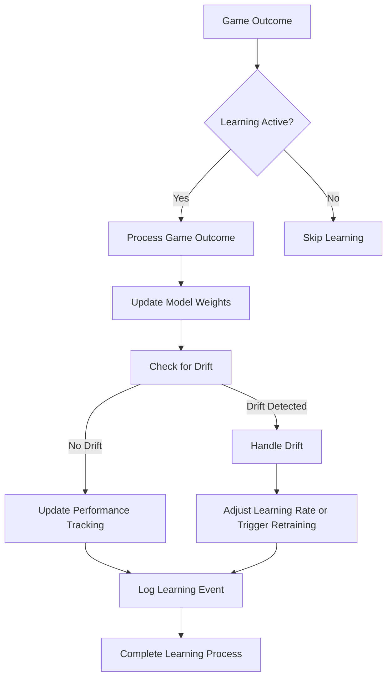
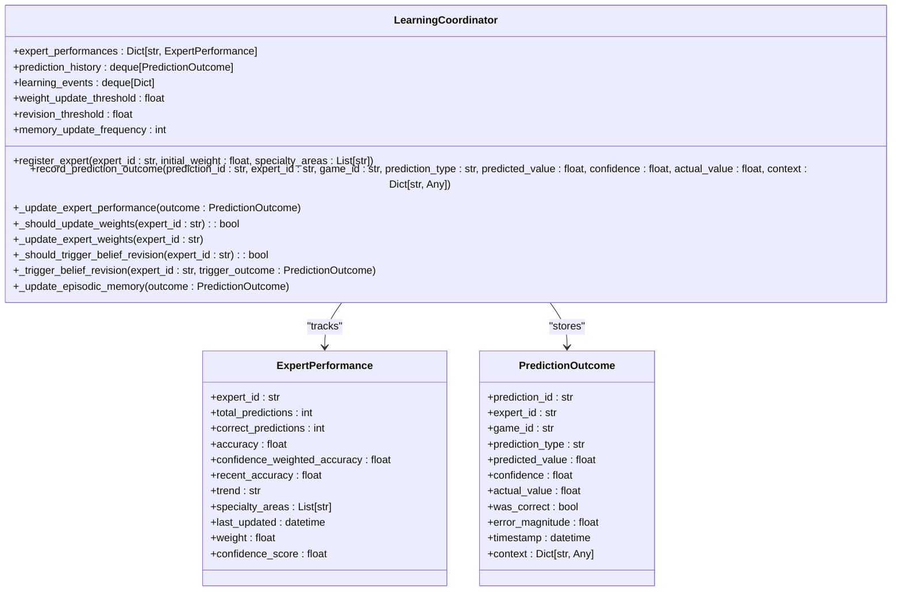
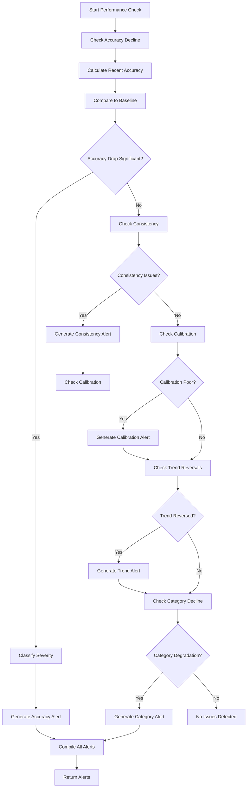
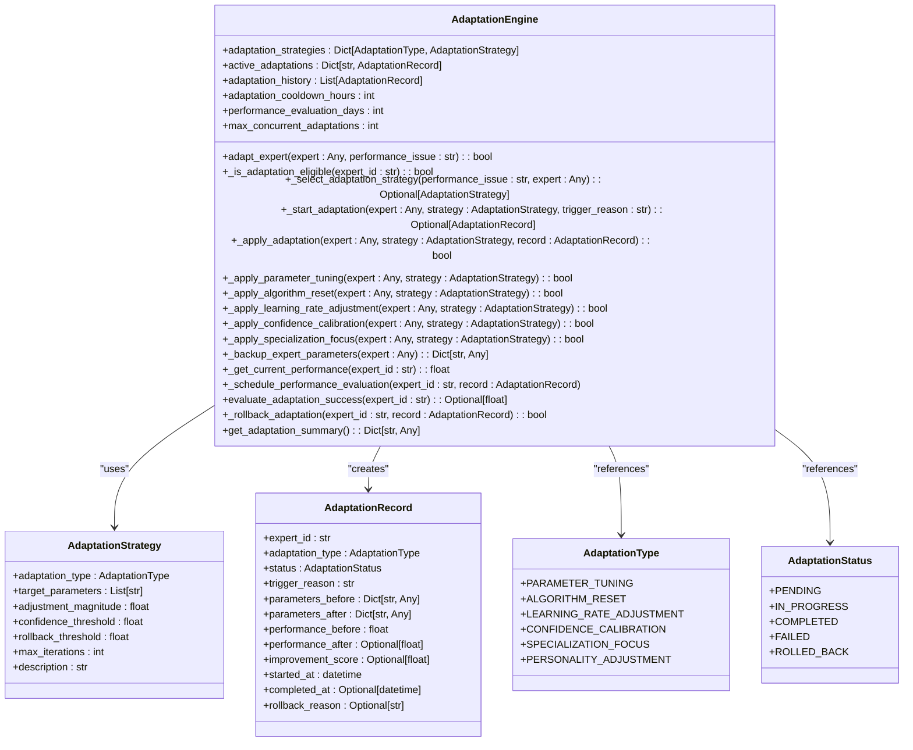

# Self-Healing System

<cite>
**Referenced Files in This Document**   
- [continuous_learner.py](file://src/ml/continuous_learner.py)
- [learning_coordinator.py](file://src/ml/learning_coordinator.py)
- [adaptation_engine.py](file://src/ml/self_healing/adaptation_engine.py)
- [performance_decline_detector.py](file://src/ml/self_healing/performance_decline_detector.py)
- [learning_pipeline_integration.py](file://src/ml/learning_pipeline_integration.py)
- [023_self_healing_system_schema.sql](file://supabase/migrations/023_self_healing_system_schema.sql)
</cite>

## Table of Contents
1. [Introduction](#introduction)
2. [Continuous Learning System](#continuous-learning-system)
3. [Learning Coordinator](#learning-coordinator)
4. [Performance Decline Detection](#performance-decline-detection)
5. [Adaptation Engine](#adaptation-engine)
6. [Learning Cycles and Feedback Loops](#learning-cycles-and-feedback-loops)
7. [Configuration and Thresholds](#configuration-and-thresholds)
8. [System Integration](#system-integration)
9. [Conclusion](#conclusion)

## Introduction
The NFL Predictor API features a sophisticated self-healing system that enables continuous learning and automatic adaptation based on real game outcomes. This system ensures long-term prediction reliability by automatically updating models and expert weights, detecting performance degradation, and triggering retraining processes. The architecture combines continuous learning with periodic comprehensive learning cycles to maintain optimal prediction accuracy across evolving NFL conditions.

**Section sources**
- [learning_coordinator.py](file://src/ml/learning_coordinator.py#L1-L50)
- [continuous_learner.py](file://src/ml/continuous_learner.py#L1-L50)

## Continuous Learning System
The continuous learning system operates in real-time, updating models immediately after each game outcome is recorded. The `ContinuousLearner` class serves as the central coordinator, processing game outcomes and applying online learning techniques to update model weights incrementally.

When a game concludes, the system processes the outcome through the `process_game_outcome` method, which receives predictions, actual results, and contextual features. For each registered model, the system calculates the prediction error and applies weight updates using online gradient descent. The `OnlineLearner` component maintains buffers of recent predictions, outcomes, and features to enable continuous model refinement.

The system implements concept drift detection to identify significant changes in prediction patterns. Using multiple detection methods including performance-based, feature distribution, and prediction distribution analysis, the `DriftDetector` monitors for gradual, sudden, or seasonal drift. When drift is detected with sufficient confidence, the system triggers appropriate responses ranging from increased learning rates to full model retraining.

Model performance is continuously tracked through metrics including accuracy, log loss, Brier score, and confidence calibration. These metrics are stored in a dedicated database and used to monitor the health of each prediction model over time. The system also maintains a history of learning events, providing an audit trail of all model updates and adaptations.



**Diagram sources **
- [continuous_learner.py](file://src/ml/continuous_learner.py#L283-L644)

**Section sources**
- [continuous_learner.py](file://src/ml/continuous_learner.py#L283-L644)

## Learning Coordinator
The Learning Coordinator serves as the central nervous system for the self-healing architecture, tracking all prediction outcomes and coordinating learning activities across experts. It maintains comprehensive performance metrics for each expert, including total predictions, correct predictions, accuracy, confidence-weighted accuracy, and recent performance trends.

The coordinator records each prediction outcome in the `record_prediction_outcome` method, which evaluates whether the prediction was correct based on the prediction type (moneyline, spread, or total) and a tolerance threshold. For spread predictions, a 3.0-point tolerance is used, while totals have a 7.0-point tolerance. The system then updates the expert's performance metrics, calculating both overall accuracy and recent accuracy based on the last 10 predictions.

Performance trends are analyzed by comparing the first and second halves of recent outcomes. If the second half shows significantly better performance, the trend is classified as "improving"; if worse, as "declining"; otherwise, "stable". This trend analysis informs weight updates and adaptation decisions.

The coordinator triggers several learning actions based on performance thresholds. When an expert's accuracy deviates significantly from neutral (0.5) or after every 10 predictions, the system updates the expert's weight. The new weight combines accuracy, confidence-weighted accuracy, recency, and trend factors with respective weights of 0.4, 0.3, 0.2, and 0.1.

For experts experiencing significant performance decline (recent accuracy below 0.3 with a declining trend), the coordinator triggers belief revision processes. This involves analyzing recent incorrect predictions as evidence and initiating belief updates through the belief revision service. The system also updates episodic memory every 5 predictions, storing outcome episodes for long-term learning.



**Diagram sources **
- [learning_coordinator.py](file://src/ml/learning_coordinator.py#L99-L749)

**Section sources**
- [learning_coordinator.py](file://src/ml/learning_coordinator.py#L99-L749)

## Performance Decline Detection
The self-healing system employs a comprehensive performance decline detection mechanism to identify experts experiencing accuracy degradation. The `PerformanceDeclineDetector` class monitors multiple dimensions of performance, including accuracy drop, consistency loss, confidence miscalibration, trend reversals, and category-specific degradation.

The system uses configurable thresholds to classify decline severity into critical, severe, moderate, and mild categories. For accuracy decline, a drop of 15% or more triggers a critical alert, 10% a severe alert, and 5% a moderate alert. These thresholds can be adjusted based on the specific requirements of different expert types.

Detection occurs across multiple time windows: short-term (7 days), medium-term (21 days), and long-term (60 days). This multi-window approach allows the system to identify both sudden performance drops and gradual degradation. The system requires a minimum number of predictions (5 for short-term, 15 for medium-term, 30 for long-term) to ensure statistical significance before triggering alerts.

When a decline is detected, the system generates detailed alerts containing the expert ID, decline type, severity level, current and baseline values, change magnitude, confidence score, time window, and specific recommendations. Critical issues trigger recommendations for immediate algorithm review and potential temporary exclusion from the AI Council, while severe issues suggest parameter tuning and data refresh.

The detector also monitors for consistency loss and confidence calibration issues. Poor calibration occurs when an expert's confidence level doesn't match their actual accuracy, leading to overconfidence or underconfidence. The system tracks calibration error and triggers alerts when it exceeds predefined thresholds.



**Diagram sources **
- [performance_decline_detector.py](file://src/ml/self_healing/performance_decline_detector.py#L87-L294)

**Section sources**
- [performance_decline_detector.py](file://src/ml/self_healing/performance_decline_detector.py#L87-L294)

## Adaptation Engine
The Adaptation Engine implements sophisticated algorithm parameter tuning and expert adaptation mechanisms to address performance issues. It manages five primary adaptation strategies: parameter tuning, algorithm reset, learning rate adjustment, confidence calibration, and specialization focus.

Each adaptation strategy has specific target parameters, adjustment magnitude, confidence threshold, and rollback threshold. Parameter tuning adjusts personality traits like risk tolerance and analytics trust with a 0.1 adjustment magnitude. Algorithm reset completely resets an expert's parameters to default values when facing severe performance decline. Learning rate adjustment modifies how quickly an expert adapts to new information, increasing the rate when performance is declining.

Before applying any adaptation, the system checks eligibility criteria including cooldown periods (24 hours minimum between adaptations), concurrent adaptation limits (maximum 3 experts adapting simultaneously), and existing adaptation status. This prevents over-adaptation and ensures system stability.

The adaptation process follows a structured workflow: first, the system checks eligibility; then selects the appropriate strategy based on the performance issue; creates a backup of current parameters; applies the adaptation; and schedules performance evaluation after a 7-day monitoring period. Each adaptation is recorded in an `AdaptationRecord` that captures parameters before and after, performance metrics, and improvement scores.

For parameter tuning, the system randomly adjusts target parameters within bounds, ensuring values remain between 0.0 and 1.0. Confidence calibration adjusts confidence scaling and uncertainty factors based on calibration performance. Specialization focus increases weights for the expert's best-performing categories, typically the top three based on accuracy.

The system evaluates adaptation success after the monitoring period. If performance improves, the adaptation is considered successful. If performance degrades by more than 10%, the system triggers a rollback to previous parameters. This safety mechanism prevents harmful adaptations from persisting.



**Diagram sources **
- [adaptation_engine.py](file://src/ml/self_healing/adaptation_engine.py#L75-L588)

**Section sources**
- [adaptation_engine.py](file://src/ml/self_healing/adaptation_engine.py#L75-L588)

## Learning Cycles and Feedback Loops
The system implements structured learning cycles that occur at daily, weekly, and monthly intervals to ensure comprehensive model improvement. These cycles are triggered through the `trigger_learning_cycle` method in the `LearningPipelineIntegration` class, which coordinates activities across all learning components.

During a learning cycle, the system first retrieves a learning summary from the coordinator, covering the appropriate time window (1 day for daily, 7 days for weekly, 30 days for monthly). It then identifies experts with recent accuracy below the revision threshold (default 0.3) and processes belief revisions for these poor performers.

The belief revision process creates a context containing the expert's recent performance and triggers the belief revision service to update the expert's knowledge base. This allows experts to learn from their mistakes and adjust their internal belief systems based on recent poor predictions.

For weekly and monthly cycles, the system also updates model weights based on recent performance. This weight adjustment combines multiple factors including accuracy, confidence-weighted accuracy, recency, and trend, with respective weights of 0.4, 0.3, 0.2, and 0.1.

The cycle concludes with the generation of a comprehensive learning report that includes the learning summary, system status, and insights from top-performing experts. This report is saved to the file system and also stored as the latest cycle report for easy access.

The feedback loop between prediction results and model improvement is continuous and multi-layered. After each game, immediate updates occur through the continuous learner. Periodically, comprehensive cycles process accumulated data to make broader adjustments. Performance monitoring continuously watches for issues, triggering targeted adaptations when needed.

```mermaid
sequenceDiagram
    participant Coordinator as LearningCoordinator
    participant Pipeline as LearningPipelineIntegration
    participant Learner as ContinuousLearner
    participant Detector as PerformanceDeclineDetector
    participant Engine as AdaptationEngine
    
    Pipeline->>Pipeline: trigger_learning_cycle("weekly")
    Pipeline->>Coordinator: get_learning_summary(7)
    Coordinator-->>Pipeline: learning_summary
    Pipeline->>Coordinator: get_expert_performance(expert_id)
    Coordinator-->>Pipeline: performance_data
    alt Experts Needing Revision