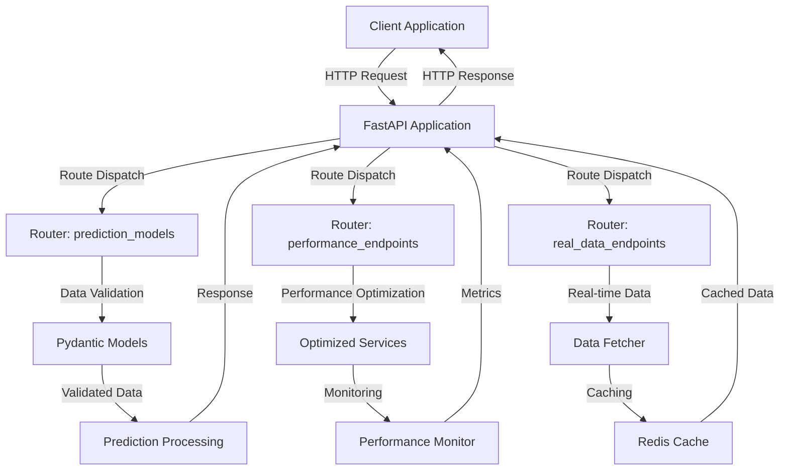
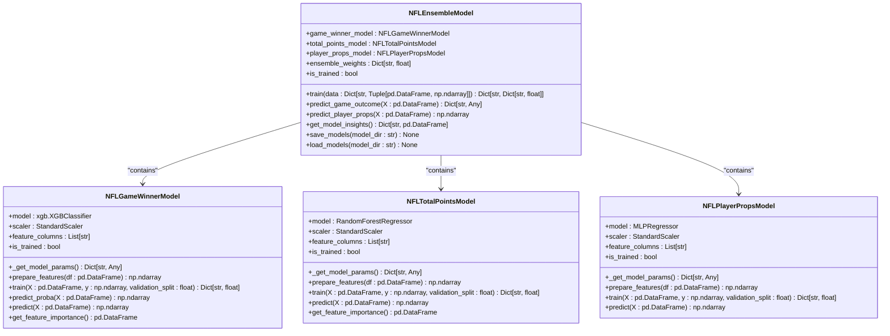
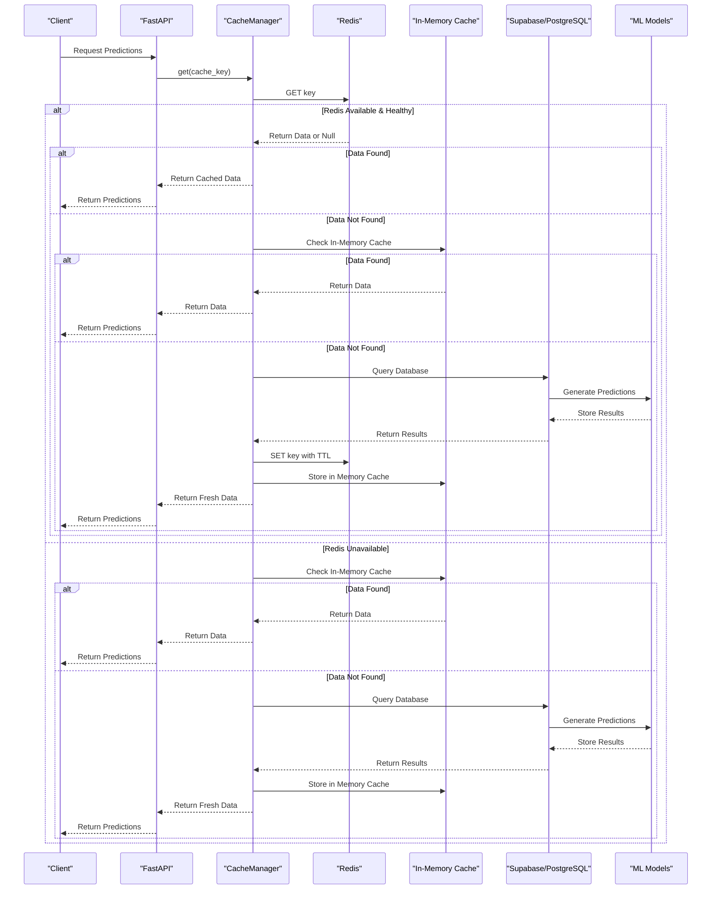
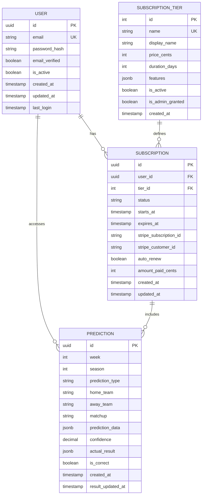
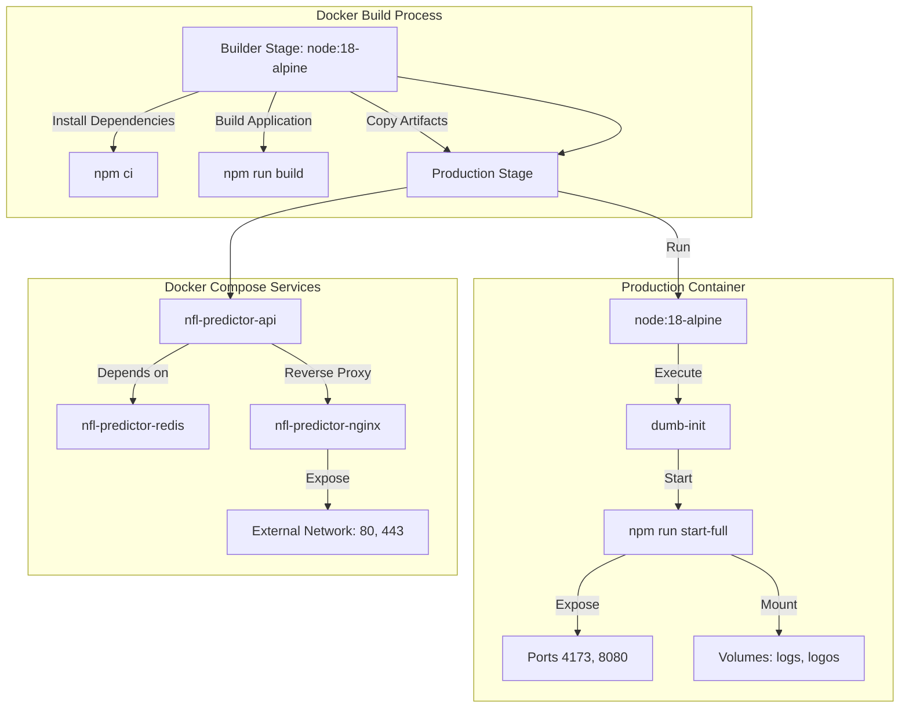

# Technology Stack & Dependencies

<cite>
**Referenced Files in This Document**   
- [requirements.txt](file://requirements.txt)
- [requirements-ml.txt](file://requirements-ml.txt)
- [requirements-production.txt](file://requirements-production.txt)
- [package.json](file://package.json)
- [Dockerfile](file://Dockerfile)
- [docker-compose.yml](file://docker-compose.yml)
- [docker-compose.prod.yml](file://docker-compose.prod.yml)
- [src/api/app.py](file://src/api/app.py)
- [src/api/prediction_models.py](file://src/api/prediction_models.py)
- [src/ml/ml_models.py](file://src/ml/ml_models.py)
- [src/cache/cache_manager.py](file://src/cache/cache_manager.py)
- [src/database/connection.py](file://src/database/connection.py)
- [src/database/models.py](file://src/database/models.py)
- [src/database/migrations.py](file://src/database/migrations.py)
</cite>

## Table of Contents
1. [Introduction](#introduction)
2. [Core Programming Languages](#core-programming-languages)
3. [Backend Framework: FastAPI](#backend-framework-fastapi)
4. [Frontend Framework: React & TypeScript](#frontend-framework-react--typescript)
5. [Machine Learning Stack](#machine-learning-stack)
6. [Data Processing with Pandas](#data-processing-with-pandas)
7. [Caching with Redis](#caching-with-redis)
8. [Database Infrastructure: Supabase & PostgreSQL](#database-infrastructure-supabase--postgresql)
9. [Containerization with Docker](#containerization-with-docker)
10. [Configuration & Dependency Management](#configuration--dependency-management)
11. [Integration Patterns](#integration-patterns)
12. [Conclusion](#conclusion)

## Introduction
The NFL Predictor API leverages a modern technology stack designed for high-performance machine learning inference, real-time data processing, and scalable API delivery. This document details the core technologies, frameworks, and infrastructure components that enable the system to generate comprehensive NFL predictions with low latency and high reliability. The architecture combines Python-based machine learning models with a React frontend, FastAPI backend, and robust infrastructure components including Supabase and Redis.

**Section sources**
- [requirements.txt](file://requirements.txt)
- [package.json](file://package.json)

## Core Programming Languages
The NFL Predictor API utilizes two primary programming languages: Python for backend and machine learning operations, and TypeScript/JavaScript for frontend development. Python serves as the foundation for the machine learning pipeline, data processing, and API implementation, leveraging its extensive ecosystem for scientific computing and machine learning. TypeScript provides type safety and enhanced developer experience for the React-based frontend, ensuring robust client-side functionality.

Python is used extensively across the backend services, machine learning models, and data processing scripts. The language's simplicity and rich library ecosystem make it ideal for implementing complex machine learning algorithms and data manipulation tasks. TypeScript enhances the frontend development process by providing static typing, which helps catch errors during development and improves code maintainability for the complex user interface components.

**Section sources**
- [requirements.txt](file://requirements.txt)
- [package.json](file://package.json)

## Backend Framework: FastAPI
FastAPI serves as the primary backend framework for the NFL Predictor API, providing high-performance API endpoints with automatic documentation generation. The framework's asynchronous capabilities enable efficient handling of concurrent requests, which is critical for delivering real-time predictions to multiple users simultaneously. FastAPI's integration with Pydantic ensures robust data validation and serialization, maintaining data integrity across the API surface.

The implementation in `src/api/app.py` demonstrates FastAPI's capabilities through a well-structured application with multiple routers for different functionality domains, including prediction endpoints, performance monitoring, and real-time data. The framework's lifespan events manage database migrations and performance optimization services during startup and shutdown, ensuring proper initialization and cleanup of resources.

FastAPI's built-in support for OpenAPI and Swagger UI provides comprehensive API documentation at the `/docs` endpoint, facilitating developer onboarding and third-party integration. The framework's middleware system enables cross-cutting concerns like CORS handling and response compression, enhancing security and performance.

**Diagram sources**
- [src/api/app.py](file://src/api/app.py#L1-L227)
- [src/api/prediction_models.py](file://src/api/prediction_models.py#L1-L336)

**Section sources**
- [src/api/app.py](file://src/api/app.py#L1-L227)
- [src/api/prediction_models.py](file://src/api/prediction_models.py#L1-L336)

## Frontend Framework: React & TypeScript
The frontend of the NFL Predictor API is built with React and TypeScript, creating a dynamic and responsive user interface for consuming predictions and analytics. React's component-based architecture enables the development of reusable UI elements, while TypeScript provides type safety that reduces runtime errors and improves code quality. The combination allows for the creation of complex, interactive dashboards that display comprehensive prediction data.

The `package.json` file reveals a modern React stack with Vite as the build tool, providing fast development server startup and optimized production builds. The dependency list includes UI component libraries like Radix UI and Tailwind CSS, which facilitate the creation of accessible and visually consistent interfaces. State management is handled through TanStack Query, which efficiently manages server state and data synchronization.

The frontend architecture supports real-time updates through WebSocket integration, allowing users to receive live prediction changes as game conditions evolve. This is particularly important for the live game prediction features, where timely updates can significantly impact user experience.

**Section sources**
- [package.json](file://package.json#L1-L76)

## Machine Learning Stack
The machine learning stack of the NFL Predictor API is built around scikit-learn and XGBoost, with additional support from TensorFlow and PyTorch. These libraries provide the foundation for implementing advanced prediction models that analyze historical data, player statistics, and game conditions to generate accurate NFL predictions. The machine learning pipeline combines multiple models into an ensemble system that leverages the strengths of different algorithms.

The `src/ml/ml_models.py` file contains the implementation of several specialized models, including XGBoost for game winner prediction, RandomForest for total points forecasting, and Neural Networks for player prop predictions. The ensemble system combines these models with weighted contributions, creating a comprehensive prediction framework that covers various aspects of NFL games.

XGBoost is particularly well-suited for the structured data common in sports analytics, providing high accuracy with efficient training times. The library's gradient boosting framework handles complex feature interactions and non-linear relationships in the data, making it effective for predicting game outcomes based on multiple factors such as team ratings, recent form, and injury impacts.

**Diagram sources**
- [src/ml/ml_models.py](file://src/ml/ml_models.py#L1-L539)

**Section sources**
- [requirements.txt](file://requirements.txt)
- [requirements-ml.txt](file://requirements-ml.txt)
- [src/ml/ml_models.py](file://src/ml/ml_models.py#L1-L539)

## Data Processing with Pandas
Pandas serves as the primary data manipulation library in the NFL Predictor API, enabling efficient processing and transformation of football statistics and prediction data. The library's DataFrame structure provides a flexible and intuitive way to handle tabular data, making it ideal for preparing features for machine learning models and formatting prediction results for API responses.

The machine learning models in `src/ml/ml_models.py` rely heavily on pandas for feature engineering, data cleaning, and preparation. The `prepare_features` methods in each model class use pandas operations to select relevant columns, handle missing values, and transform raw data into the format required by the underlying algorithms. This preprocessing step is critical for ensuring model accuracy and performance.

Pandas also facilitates exploratory data analysis and model evaluation, allowing developers to quickly assess data quality, identify patterns, and validate model outputs. The integration with other scientific Python libraries like NumPy and scikit-learn creates a seamless workflow for data science tasks within the application.

**Section sources**
- [requirements.txt](file://requirements.txt)
- [src/ml/ml_models.py](file://src/ml/ml_models.py#L1-L539)

## Caching with Redis
Redis is implemented as the primary caching solution in the NFL Predictor API, providing low-latency data storage for frequently accessed prediction results and API responses. The cache manager in `src/cache/cache_manager.py` implements a hybrid approach with Redis as the primary cache and an in-memory fallback, ensuring availability even if the Redis service becomes temporarily unavailable.

The caching strategy focuses on reducing database load and improving response times for expensive operations like comprehensive prediction generation. Cache keys are generated based on prediction parameters such as week, prediction type, and year, allowing for efficient retrieval of previously computed results. The implementation includes TTL (time-to-live) management to ensure data freshness while maintaining performance benefits.

The cache manager also provides health monitoring and metrics collection, enabling proactive detection of caching issues. The warm cache functionality pre-loads popular data sets, reducing latency for common user requests. This is particularly important during peak usage periods, such as before and during NFL games.

**Diagram sources**
- [src/cache/cache_manager.py](file://src/cache/cache_manager.py#L1-L431)
- [src/api/app.py](file://src/api/app.py#L1-L227)

**Section sources**
- [requirements.txt](file://requirements.txt)
- [src/cache/cache_manager.py](file://src/cache/cache_manager.py#L1-L431)

## Database Infrastructure: Supabase & PostgreSQL
The NFL Predictor API utilizes Supabase as its database infrastructure, leveraging PostgreSQL for relational data storage and pgvector for vector-based operations. This combination provides a robust foundation for storing user data, prediction results, and historical statistics while enabling advanced querying capabilities. The database schema, defined in `src/database/models.py`, includes comprehensive models for user authentication, subscriptions, and prediction tracking.

Supabase extends PostgreSQL with additional features like real-time subscriptions, authentication, and storage, creating a complete backend-as-a-service solution. The integration with the application is managed through SQLAlchemy, which provides an ORM layer for Python applications. This abstraction simplifies database interactions while maintaining the full power of SQL for complex queries.

The database design includes optimized indexes and constraints to ensure data integrity and query performance. The migration system in `src/database/migrations.py` manages schema evolution and initial data seeding, ensuring consistent database state across different environments. The connection pooling and pre-ping features in the database configuration help maintain reliable connections under high load.

**Diagram sources**
- [src/database/models.py](file://src/database/models.py#L1-L403)
- [src/database/migrations.py](file://src/database/migrations.py#L1-L177)

**Section sources**
- [src/database/connection.py](file://src/database/connection.py#L1-L42)
- [src/database/models.py](file://src/database/models.py#L1-L403)
- [src/database/migrations.py](file://src/database/migrations.py#L1-L177)

## Containerization with Docker
Docker is used to containerize the NFL Predictor API, ensuring consistent deployment across different environments and simplifying infrastructure management. The `Dockerfile` implements a multi-stage build process that separates development dependencies from the production runtime, resulting in a lean and secure container image. This approach reduces the attack surface and improves startup times.

The containerization strategy includes best practices such as using non-root users, installing minimal dependencies, and implementing health checks. The `docker-compose.yml` and `docker-compose.prod.yml` files define the service topology, including the main application, Redis cache, and Nginx reverse proxy. This orchestration enables easy scaling and management of the complete system.

The production Docker configuration includes resource limits and reservations, ensuring stable performance under load. The health check mechanism monitors application availability and triggers restarts if necessary, improving system reliability. The use of dumb-init as the entrypoint ensures proper signal handling and graceful shutdown of the application.

**Diagram sources**
- [Dockerfile](file://Dockerfile#L1-L64)
- [docker-compose.yml](file://docker-compose.yml#L1-L72)
- [docker-compose.prod.yml](file://docker-compose.prod.yml#L1-L76)

**Section sources**
- [Dockerfile](file://Dockerfile#L1-L64)
- [docker-compose.yml](file://docker-compose.yml#L1-L72)
- [docker-compose.prod.yml](file://docker-compose.prod.yml#L1-L76)

## Configuration & Dependency Management
The NFL Predictor API employs a comprehensive dependency management strategy using separate requirements files for different environments. The `requirements.txt` file contains core dependencies for development, while `requirements-ml.txt` focuses on machine learning libraries, and `requirements-production.txt` includes production-specific packages. This separation ensures that only necessary dependencies are installed in each environment, reducing attack surface and improving deployment efficiency.

The dependency versions are pinned to specific releases in the main requirements file, providing stability and reproducible builds. The production requirements use version ranges with minimum constraints, allowing for security updates while maintaining compatibility. This approach balances stability with the ability to incorporate important fixes and improvements.

Configuration is managed through environment variables and `.env` files, allowing for easy customization across different deployment environments. The Docker and Docker Compose configurations integrate with this system, passing environment variables to containers and supporting different configuration files for development and production.

**Section sources**
- [requirements.txt](file://requirements.txt)
- [requirements-ml.txt](file://requirements-ml.txt)
- [requirements-production.txt](file://requirements-production.txt)
- [docker-compose.yml](file://docker-compose.yml#L1-L72)
- [docker-compose.prod.yml](file://docker-compose.prod.yml#L1-L76)

## Integration Patterns
The NFL Predictor API demonstrates several key integration patterns between frontend and backend technologies. The most significant is the real-time data flow enabled by WebSocket integration, which allows the React frontend to receive live prediction updates as game conditions change. This pattern is critical for maintaining an engaging user experience during live games.

The API follows RESTful principles for most endpoints, with clear resource naming and HTTP method usage. The FastAPI backend provides automatic OpenAPI documentation, which can be used to generate client libraries for the frontend. This tight integration reduces development effort and ensures consistency between the API contract and its implementation.

The caching layer acts as an integration point between the database and application logic, reducing load on the Supabase instance while improving response times. The cache manager abstracts the Redis implementation, allowing the application code to interact with a simple interface while benefiting from distributed caching capabilities.

**Section sources**
- [src/api/app.py](file://src/api/app.py#L1-L227)
- [package.json](file://package.json#L1-L76)
- [src/cache/cache_manager.py](file://src/cache/cache_manager.py#L1-L431)

## Conclusion
The NFL Predictor API leverages a sophisticated technology stack that combines modern web frameworks, advanced machine learning libraries, and robust infrastructure components. The integration of Python and TypeScript/JavaScript enables specialized implementations for backend processing and frontend presentation, while FastAPI and React provide high-performance foundations for their respective domains.

The machine learning stack, built on scikit-learn and XGBoost, delivers accurate predictions through