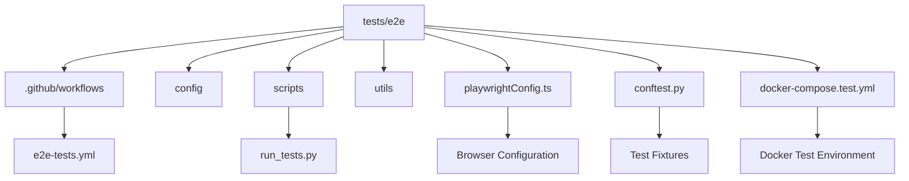
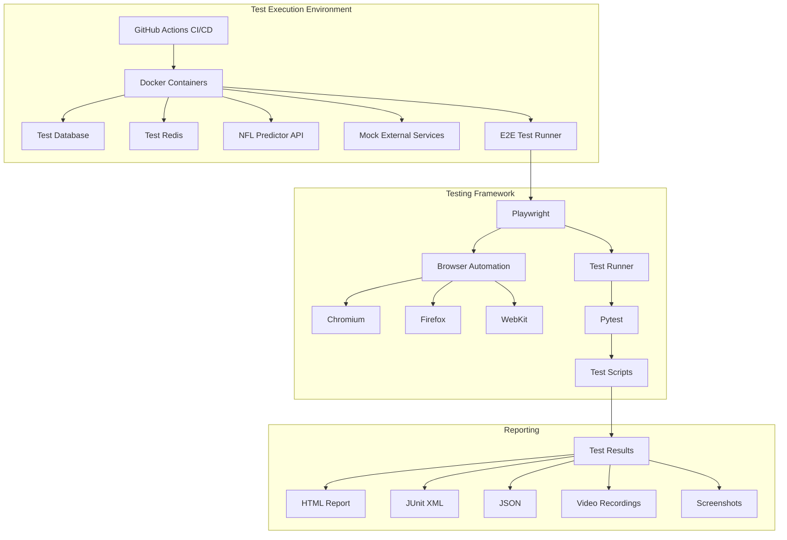
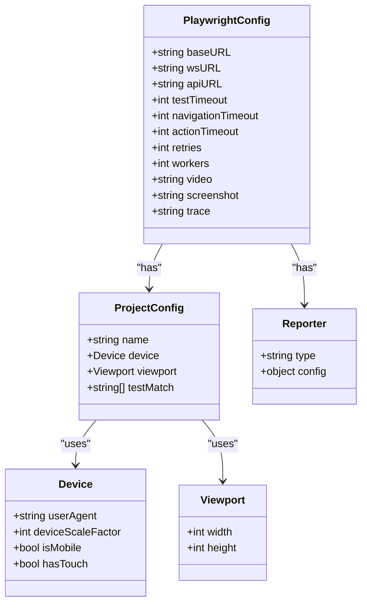
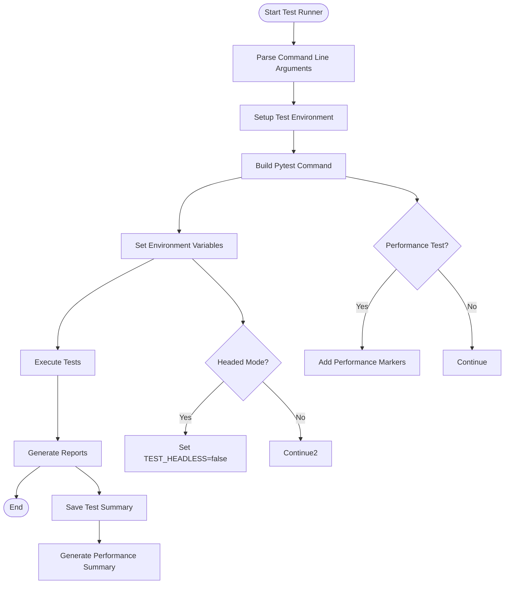
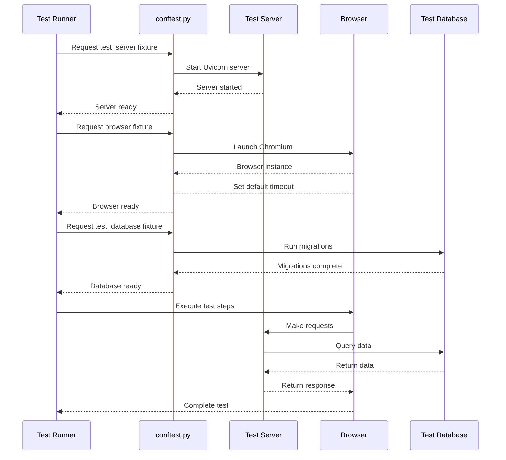
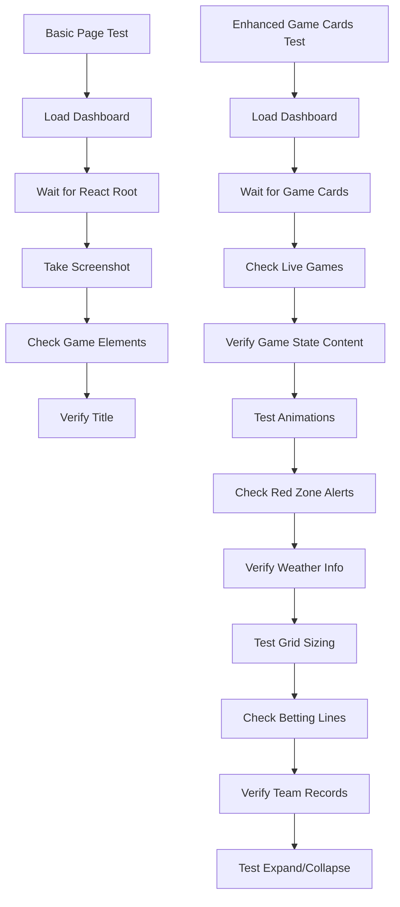
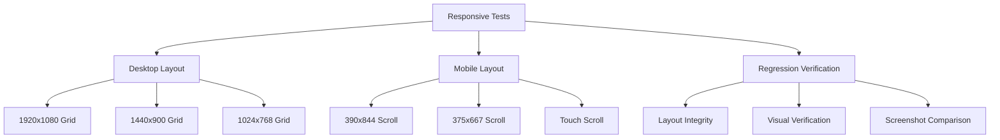
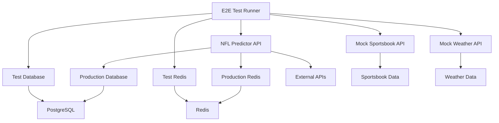
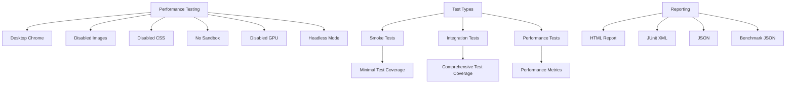
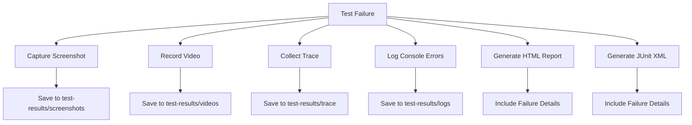

# End-to-End Testing

<cite>
**Referenced Files in This Document**   
- [playwrightConfig.ts](file://tests/e2e/playwrightConfig.ts) - *Updated in recent commit*
- [e2e-tests.yml](file://tests/e2e/.github/workflows/e2e-tests.yml)
- [run_tests.py](file://tests/e2e/scripts/run_tests.py)
- [conftest.py](file://tests/e2e/conftest.py)
- [basic-page-test.spec.js](file://tests/e2e/basic-page-test.spec.js)
- [enhanced-game-cards.spec.js](file://tests/e2e/enhanced-game-cards.spec.js)
- [docker-compose.test.yml](file://tests/e2e/docker-compose.test.yml)
- [Dockerfile](file://Dockerfile)
- [expert-section-responsive.spec.ts](file://tests/expert-section-responsive.spec.ts) - *Added in recent commit*
- [desktop-regression.spec.ts](file://tests/desktop-regression.spec.ts) - *Added in recent commit*
- [mobile-features.spec.ts](file://tests/mobile-features.spec.ts) - *Added in recent commit*
- [VERIFICATION-REPORT.md](file://tests/VERIFICATION-REPORT.md) - *Updated in recent commit*
</cite>

## Update Summary
- Added comprehensive responsive testing for expert section across multiple viewports
- Integrated desktop regression testing to ensure layout integrity
- Enhanced mobile feature testing with hamburger menu and navigation drawer interactions
- Added visual verification through screenshot capture for responsive layouts
- Updated documentation to reflect new test suites and verification methodology

## Table of Contents
1. [Introduction](#introduction)
2. [Project Structure](#project-structure)
3. [Core Components](#core-components)
4. [Architecture Overview](#architecture-overview)
5. [Detailed Component Analysis](#detailed-component-analysis)
6. [Dependency Analysis](#dependency-analysis)
7. [Performance Considerations](#performance-considerations)
8. [Troubleshooting Guide](#troubleshooting-guide)
9. [Conclusion](#conclusion)

## Introduction
The NFL Predictor API employs a comprehensive end-to-end testing strategy using Playwright to ensure reliability, performance, and user experience across all critical user journeys. This documentation details the testing framework setup, execution workflow, and coverage of key features including prediction fetching, expert analysis viewing, and live game monitoring. The E2E tests validate the full stack from UI components through API endpoints to database interactions, with special emphasis on real-time WebSocket updates, dynamic game card rendering, and responsive dashboard behavior. The testing infrastructure leverages Docker for environment consistency and GitHub Actions for CI/CD pipeline integration, ensuring reliable test execution across different environments.

## Project Structure
The end-to-end testing framework is organized within the `tests/e2e` directory, following a structured approach that separates configuration, test scripts, utilities, and reporting. The framework supports multiple execution environments and provides comprehensive reporting capabilities.

**Diagram sources**
- [playwrightConfig.ts](file://tests/e2e/playwrightConfig.ts)
- [.github/workflows/e2e-tests.yml](file://tests/e2e/.github/workflows/e2e-tests.yml)
- [docker-compose.test.yml](file://tests/e2e/docker-compose.test.yml)

**Section sources**
- [playwrightConfig.ts](file://tests/e2e/playwrightConfig.ts)
- [.github/workflows/e2e-tests.yml](file://tests/e2e/.github/workflows/e2e-tests.yml)
- [docker-compose.test.yml](file://tests/e2e/docker-compose.test.yml)

## Core Components
The E2E testing framework consists of several core components that work together to provide comprehensive test coverage. These include the Playwright configuration, test runner script, shared fixtures, and test specifications that validate critical user journeys. The framework is designed to test the full stack from UI components to API endpoints and database interactions, with special focus on real-time features and responsive design.

**Section sources**
- [playwrightConfig.ts](file://tests/e2e/playwrightConfig.ts)
- [run_tests.py](file://tests/e2e/scripts/run_tests.py)
- [conftest.py](file://tests/e2e/conftest.py)

## Architecture Overview
The E2E testing architecture is designed to provide comprehensive coverage of the NFL Predictor API across multiple dimensions including functionality, performance, and user experience. The framework supports cross-browser and cross-device testing, with configurations for desktop, mobile, and tablet devices.

**Diagram sources**
- [.github/workflows/e2e-tests.yml](file://tests/e2e/.github/workflows/e2e-tests.yml)
- [docker-compose.test.yml](file://tests/e2e/docker-compose.test.yml)
- [playwrightConfig.ts](file://tests/e2e/playwrightConfig.ts)

## Detailed Component Analysis

### Playwright Configuration
The Playwright configuration file defines the test environment settings, browser configurations, and reporting options for the E2E tests. It supports multiple projects for different device types and testing scenarios.

**Diagram sources**
- [playwrightConfig.ts](file://tests/e2e/playwrightConfig.ts)

**Section sources**
- [playwrightConfig.ts](file://tests/e2e/playwrightConfig.ts)

### Test Runner Script
The test runner script provides a command-line interface for executing E2E tests with various configurations and reporting options. It supports different execution modes, parallel execution, and comprehensive reporting.

**Diagram sources**
- [run_tests.py](file://tests/e2e/scripts/run_tests.py)

**Section sources**
- [run_tests.py](file://tests/e2e/scripts/run_tests.py)

### Test Fixtures and Configuration
The test fixtures provide shared setup and teardown functionality for E2E tests, including test server startup, browser initialization, and database setup. These fixtures ensure consistent test execution across different test files.

**Diagram sources**
- [conftest.py](file://tests/e2e/conftest.py)

**Section sources**
- [conftest.py](file://tests/e2e/conftest.py)

### Test Specification Examples
The test specifications validate critical user journeys such as fetching predictions, viewing expert analysis, and monitoring live games. These tests cover both functional and non-functional requirements.

**Diagram sources**
- [basic-page-test.spec.js](file://tests/e2e/basic-page-test.spec.js)
- [enhanced-game-cards.spec.js](file://tests/e2e/enhanced-game-cards.spec.js)

**Section sources**
- [basic-page-test.spec.js](file://tests/e2e/basic-page-test.spec.js)
- [enhanced-game-cards.spec.js](file://tests/e2e/enhanced-game-cards.spec.js)

### Responsive Testing Suite
The responsive testing suite validates the AI Experts section across multiple viewports, ensuring proper layout behavior on both desktop and mobile devices. The tests verify grid layout on desktop and horizontal scroll with snap behavior on mobile.

**Diagram sources**
- [expert-section-responsive.spec.ts](file://tests/expert-section-responsive.spec.ts)
- [desktop-regression.spec.ts](file://tests/desktop-regression.spec.ts)
- [mobile-features.spec.ts](file://tests/mobile-features.spec.ts)

**Section sources**
- [expert-section-responsive.spec.ts](file://tests/expert-section-responsive.spec.ts) - *Added in recent commit*
- [desktop-regression.spec.ts](file://tests/desktop-regression.spec.ts) - *Added in recent commit*
- [mobile-features.spec.ts](file://tests/mobile-features.spec.ts) - *Added in recent commit*
- [VERIFICATION-REPORT.md](file://tests/VERIFICATION-REPORT.md) - *Updated in recent commit*

## Dependency Analysis
The E2E testing framework has dependencies on various components and services that must be properly configured for successful test execution. These include the test database, Redis cache, API server, and external service mocks.

**Diagram sources**
- [docker-compose.test.yml](file://tests/e2e/docker-compose.test.yml)

**Section sources**
- [docker-compose.test.yml](file://tests/e2e/docker-compose.test.yml)

## Performance Considerations
The E2E testing framework includes performance testing configurations and options to ensure the NFL Predictor API meets performance requirements under various conditions. The framework supports performance testing with disabled images and CSS to measure core performance.

**Diagram sources**
- [playwrightConfig.ts](file://tests/e2e/playwrightConfig.ts)
- [run_tests.py](file://tests/e2e/scripts/run_tests.py)

**Section sources**
- [playwrightConfig.ts](file://tests/e2e/playwrightConfig.ts)
- [run_tests.py](file://tests/e2e/scripts/run_tests.py)

## Troubleshooting Guide
The E2E testing framework includes several features to aid in troubleshooting test failures, including screenshot capture, video recording, and detailed logging. These features help identify and resolve issues quickly.

**Diagram sources**
- [playwrightConfig.ts](file://tests/e2e/playwrightConfig.ts)
- [conftest.py](file://tests/e2e/conftest.py)

**Section sources**
- [playwrightConfig.ts](file://tests/e2e/playwrightConfig.ts)
- [conftest.py](file://tests/e2e/conftest.py)

## Conclusion
The end-to-end testing framework for the NFL Predictor API provides comprehensive coverage of critical user journeys and system functionality. By leveraging Playwright for browser automation, Docker for environment consistency, and GitHub Actions for CI/CD integration, the framework ensures reliable test execution across different environments. The testing strategy validates the full stack from UI components through API endpoints to database interactions, with special emphasis on real-time features and responsive design. The framework's comprehensive reporting and troubleshooting capabilities enable rapid identification and resolution of issues, ensuring high-quality releases.