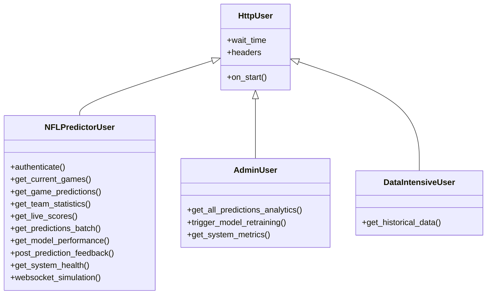

# Load and Performance Testing

<cite>
**Referenced Files in This Document**   
- [locustfile.py](file://tests/load/locustfile.py)
- [monitoring_dashboard.py](file://tests/load/monitoring_dashboard.py)
- [README.md](file://tests/load/README.md)
- [locust.conf](file://tests/load/locust.conf)
- [run_load_tests.sh](file://tests/load/scripts/run_load_tests.sh)
</cite>

## Table of Contents
1. [Introduction](#introduction)
2. [Load Testing Framework](#load-testing-framework)
3. [Test Scenarios and User Behavior](#test-scenarios-and-user-behavior)
4. [Distributed Load Testing Configuration](#distributed-load-testing-configuration)
5. [Performance Monitoring and Dashboard](#performance-monitoring-and-dashboard)
6. [Bottleneck Detection and Analysis](#bottleneck-detection-and-analysis)
7. [CI/CD Integration](#cicd-integration)
8. [Test Execution and Reporting](#test-execution-and-reporting)
9. [Performance Baselines and Validation](#performance-baselines-and-validation)
10. [Troubleshooting and Optimization](#troubleshooting-and-optimization)

## Introduction

The NFL Predictor API load and performance testing framework is designed to validate system scalability, reliability, and performance under various traffic conditions. This comprehensive suite simulates real-world usage patterns including high-concurrency scenarios for prediction endpoints and WebSocket connections. The framework enables benchmarking of response times, throughput, and system stability during peak loads such as game day traffic spikes. It integrates monitoring dashboards to track CPU, memory, and database performance, while detecting bottlenecks, memory leaks, and database connection pool exhaustion.

The testing infrastructure supports simulating over 1000 concurrent users fetching real-time predictions and live game updates, providing critical insights for performance regression tracking, SLA validation, and capacity planning. The framework is integrated with CI/CD pipelines for automated performance validation, ensuring consistent quality across deployments.

**Section sources**
- [README.md](file://tests/load/README.md#L1-L332)

## Load Testing Framework

The load testing framework is built on Locust, a Python-based open-source load testing tool that allows for defining user behavior with code. The framework simulates various user types with different behavior patterns to accurately represent real-world traffic to the NFL Predictor API.

The core of the framework is the `locustfile.py` which defines multiple user classes that simulate different types of users interacting with the API. These include typical users, admin users, and data-intensive users, each with distinct request patterns and frequencies. The framework supports both headless execution for automated testing and web UI mode for interactive test configuration and monitoring.

**Diagram sources**
- [locustfile.py](file://tests/load/locustfile.py#L12-L362)

**Section sources**
- [locustfile.py](file://tests/load/locustfile.py#L12-L362)

## Test Scenarios and User Behavior

The framework implements multiple test scenarios that simulate different user behaviors and traffic patterns. Each user class represents a specific type of user with distinct interaction patterns with the API.

The `NFLPredictorUser` class simulates typical users with a weighted task distribution that reflects real-world usage patterns. The most frequent operation is retrieving current games (weight 10), followed by getting game predictions (weight 8) and team statistics (weight 6). Less frequent operations include retrieving live scores, prediction batches, and model performance metrics. The user simulation includes authentication