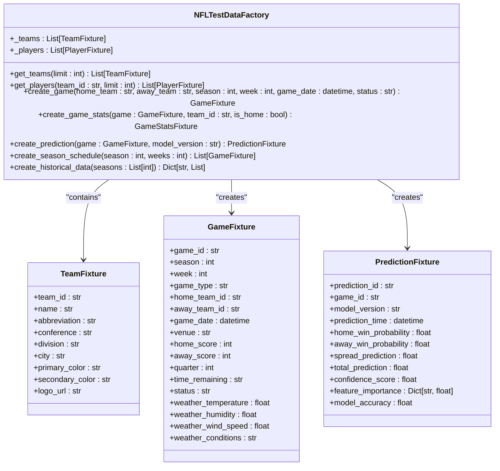
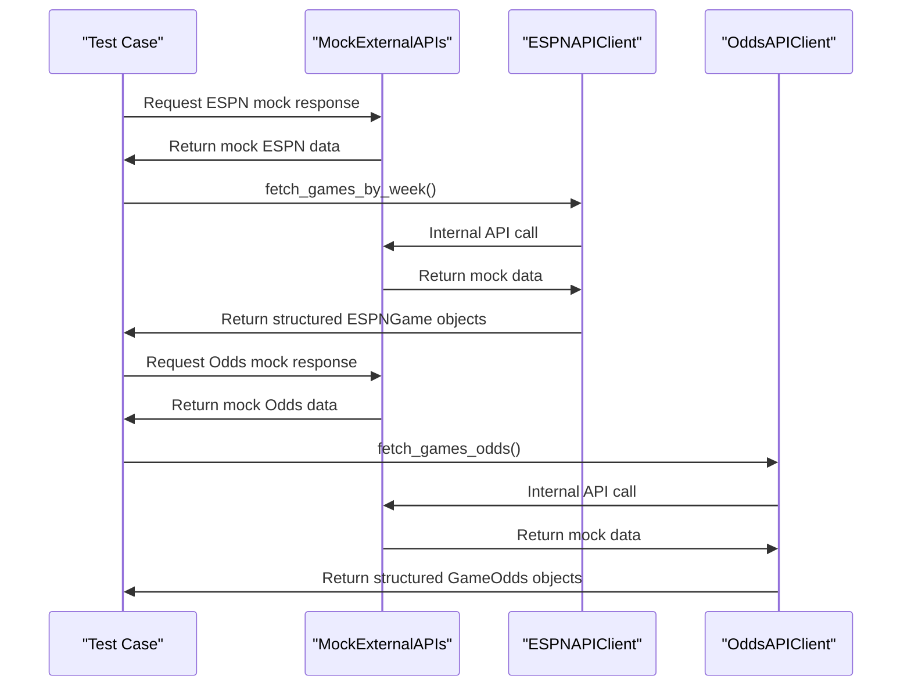
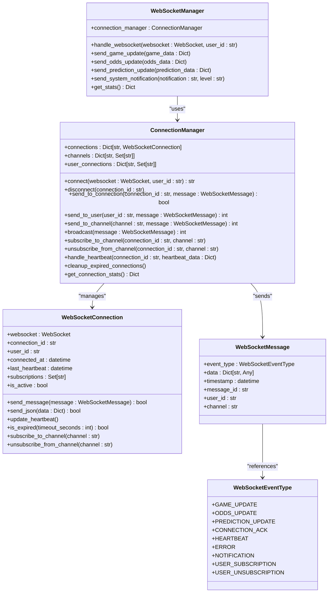
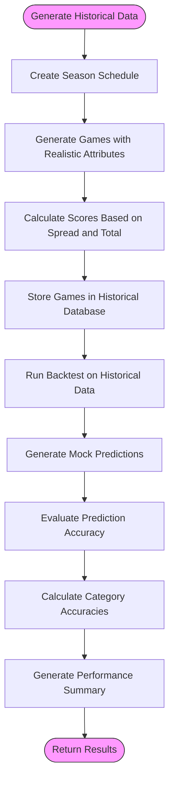
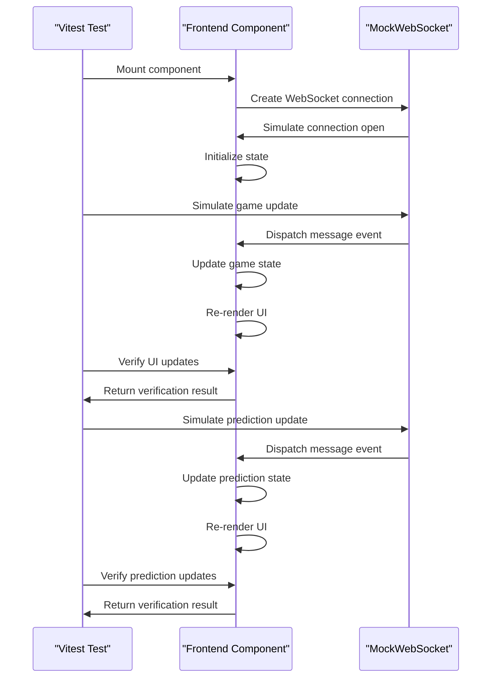

# Test Data and Mocking Strategy

<cite>
**Referenced Files in This Document**   
- [database_fixtures.py](file://tests/fixtures/database_fixtures.py)
- [mock_data.py](file://tests/fixtures/mock_data.py)
- [mock_responses.py](file://tests/fixtures/mock_responses.py)
- [comprehensive_system_testing.py](file://src/ml/testing/comprehensive_system_testing.py)
- [backtesting_framework.py](file://src/ml/testing/backtesting_framework.py)
- [historical_performance_tracking.py](file://src/ml/testing/historical_performance_tracking.py)
- [WebSocket.js](file://tests/frontend/__mocks__/WebSocket.js)
- [websocket_api.py](file://src/api/websocket_api.py)
- [websocket_manager.py](file://src/websocket/websocket_manager.py)
- [websocket_events.py](file://src/websocket/websocket_events.py)
- [espn_api_client.py](file://src/api/espn_api_client.py)
- [odds_api_client.py](file://src/api/odds_api_client.py)
</cite>

## Table of Contents
1. [Introduction](#introduction)
2. [Database Fixtures and Test Data](#database-fixtures-and-test-data)
3. [External API Mocking Strategy](#external-api-mocking-strategy)
4. [WebSocket Mocking and Real-Time Testing](#websocket-mocking-and-real-time-testing)
5. [Prediction and Historical Data Generation](#prediction-and-historical-data-generation)
6. [Frontend Testing with Vitest](#frontend-testing-with-vitest)
7. [Mock Data Consistency and Maintenance](#mock-data-consistency-and-maintenance)
8. [Conclusion](#conclusion)

## Introduction
This document outlines the comprehensive test data management and mocking strategy for the NFL Predictor API. The system employs a multi-layered approach to ensure reliable, fast, and accurate testing across both backend and frontend components. The strategy focuses on creating consistent test data for games, predictions, and expert systems while implementing robust mocking for external APIs including ESPN, Odds, and Supabase. Special attention is given to WebSocket mocks for testing real-time update handling in frontend components. The framework supports the generation of realistic prediction datasets and historical game data for accuracy validation tests, leveraging pytest fixtures for dependency injection and Vitest mocks for frontend service isolation.

## Database Fixtures and Test Data
The NFL Predictor API utilizes a comprehensive database fixture system to seed consistent test data for games, predictions, and expert systems. The core implementation is found in `database_fixtures.py`, which defines dataclasses for various NFL entities including TeamFixture, PlayerFixture, GameFixture, GameStatsFixture, and PredictionFixture. These fixtures provide a structured approach to generating test data with realistic attributes and relationships.

The NFLTestDataFactory class serves as the primary mechanism for creating test data, offering methods to generate teams, players, games, game statistics, and ML predictions. The factory ensures data consistency by maintaining internal collections of teams and players that can be referenced across different test scenarios. Game creation is parameterized, allowing tests to specify home and away teams, season, week, game date, and status. The factory also supports the creation of full season schedules and historical data spanning multiple seasons.

**Diagram sources**
- [database_fixtures.py](file://tests/fixtures/database_fixtures.py#L1-L519)

**Section sources**
- [database_fixtures.py](file://tests/fixtures/database_fixtures.py#L1-L519)

## External API Mocking Strategy
The NFL Predictor API implements a sophisticated mocking strategy for external APIs to ensure reliable and fast tests. The system mocks three primary external services: ESPN for game data, Odds API for betting lines, and weather services for environmental conditions. The mocking framework is implemented in `mock_responses.py` through the MockExternalAPIs class, which provides methods to generate realistic mock responses for each external service.

For ESPN API mocking, the system generates responses that mimic the ESPN API's scoreboard endpoint, including game IDs, commencement times, team information, and bookmaker odds. The mock data includes multiple bookmakers such as DraftKings and FanDuel, with realistic odds for moneyline, spreads, and totals markets. The OddsAPIClient is mocked to return structured GameOdds objects containing spreads, totals, and moneylines from various sportsbooks.

**Diagram sources**
- [mock_responses.py](file://tests/fixtures/mock_responses.py#L1-L591)
- [espn_api_client.py](file://src/api/espn_api_client.py#L1-L480)
- [odds_api_client.py](file://src/api/odds_api_client.py#L1-L389)

**Section sources**
- [mock_responses.py](file://tests/fixtures/mock_responses.py#L1-L591)
- [espn_api_client.py](file://src/api/espn_api_client.py#L1-L480)
- [odds_api_client.py](file://src/api/odds_api_client.py#L1-L389)

## WebSocket Mocking and Real-Time Testing
The NFL Predictor API features a comprehensive WebSocket mocking system for testing real-time update handling in frontend components. The implementation is centered around the MockWebSocket class in `WebSocket.js`, which extends EventTarget to provide a realistic WebSocket interface for testing. This mock implementation supports all standard WebSocket events including open, message, error, and close, allowing frontend components to be tested with realistic real-time behavior.

The WebSocketManager in `websocket_manager.py` handles the server-side WebSocket connections and broadcasting. It maintains a collection of active connections and supports channel-based subscriptions, allowing clients to subscribe to specific game updates, odds changes, or prediction refreshes. The system implements heartbeat monitoring to detect and clean up inactive connections, ensuring reliable real-time communication.

**Diagram sources**
- [websocket_manager.py](file://src/websocket/websocket_manager.py#L1-L364)
- [websocket_events.py](file://src/websocket/websocket_events.py#L1-L120)
- [WebSocket.js](file://tests/frontend/__mocks__/WebSocket.js#L1-L246)

**Section sources**
- [websocket_manager.py](file://src/websocket/websocket_manager.py#L1-L364)
- [websocket_events.py](file://src/websocket/websocket_events.py#L1-L120)
- [WebSocket.js](file://tests/frontend/__mocks__/WebSocket.js#L1-L246)

## Prediction and Historical Data Generation
The NFL Predictor API employs advanced frameworks for generating realistic prediction datasets and historical game data for accuracy validation tests. The backtesting_framework.py implements a comprehensive system for evaluating expert predictions against historical data, while historical_performance_tracking.py provides tools for analyzing performance trends over time.

The BacktestingFramework class generates realistic historical NFL data using statistical distributions to simulate game outcomes, spreads, and totals. It evaluates prediction accuracy across multiple categories including winner prediction, exact score, against the spread, and over/under. The framework calculates overall accuracy and category-specific accuracies, providing detailed performance summaries for each expert.

**Diagram sources**
- [backtesting_framework.py](file://src/ml/testing/backtesting_framework.py#L1-L192)
- [historical_performance_tracking.py](file://src/ml/testing/historical_performance_tracking.py#L1-L738)

**Section sources**
- [backtesting_framework.py](file://src/ml/testing/backtesting_framework.py#L1-L192)
- [historical_performance_tracking.py](file://src/ml/testing/historical_performance_tracking.py#L1-L738)

## Frontend Testing with Vitest
The frontend testing strategy for the NFL Predictor API leverages Vitest mocks for service isolation and component testing. The system uses the MockWebSocket implementation to test real-time components such as live game updates, prediction refreshes, and system notifications. The mock provides methods to simulate various WebSocket events, allowing comprehensive testing of the frontend's real-time capabilities.

The testing framework includes utilities to verify that components correctly handle different WebSocket message types, update state appropriately, and display real-time information to users. Tests can simulate connection failures, slow networks, and message delays to ensure the frontend provides appropriate feedback and maintains usability under various network conditions.

**Diagram sources**
- [WebSocket.js](file://tests/frontend/__mocks__/WebSocket.js#L1-L246)

**Section sources**
- [WebSocket.js](file://tests/frontend/__mocks__/WebSocket.js#L1-L246)

## Mock Data Consistency and Maintenance
The NFL Predictor API addresses the challenge of maintaining mock data consistency across test environments through a structured approach to mock data generation and validation. The system uses data factories and generators that create consistent, reproducible test data based on configurable parameters and random seeds. This ensures that tests produce the same results across