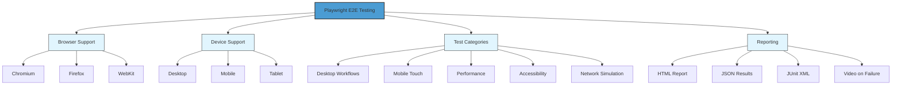
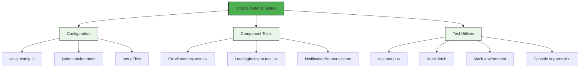

# Testing Strategy

<cite>
**Referenced Files in This Document**   
- [comprehensive_system_testing.py](file://src/ml/testing/comprehensive_system_testing.py)
- [playwrightConfig.ts](file://tests/e2e/playwrightConfig.ts)
- [basic-page-test.spec.js](file://tests/e2e/basic-page-test.spec.js)
- [vitest.config.ts](file://vitest.config.ts)
- [locustfile.py](file://tests/load/locustfile.py)
- [ErrorBoundary.test.tsx](file://tests/frontend/components/ErrorBoundary.test.tsx)
- [LoadingIndicator.test.tsx](file://tests/frontend/components/LoadingIndicator.test.tsx)
- [NotificationBanner.test.tsx](file://tests/frontend/components/NotificationBanner.test.tsx)
- [test-setup.ts](file://tests/frontend/test-setup.ts)
- [TEST_SUITE_SUMMARY.md](file://tests/TEST_SUITE_SUMMARY.md)
</cite>

## Table of Contents
1. [Introduction](#introduction)
2. [Multi-Layered Testing Approach](#multi-layered-testing-approach)
3. [End-to-End Testing with Playwright](#end-to-end-testing-with-playwright)
4. [Frontend Component Testing with Vitest](#frontend-component-testing-with-vitest)
5. [Load Testing with Locust](#load-testing-with-locust)
6. [Test Suite Organization and Data Management](#test-suite-organization-and-data-management)
7. [CI/CD Integration and Test Execution](#cicd-integration-and-test-execution)
8. [Code Coverage and Test Reliability](#code-coverage-and-test-reliability)
9. [Conclusion](#conclusion)

## Introduction
The NFL Predictor API employs a comprehensive, multi-layered testing strategy designed to ensure prediction accuracy, system reliability, and performance SLAs. This document details the complete quality assurance framework that validates the system across unit, integration, end-to-end, and load testing dimensions. The testing infrastructure supports 15 expert models generating predictions across 375+ categories, ensuring the platform delivers accurate, reliable results under various conditions and traffic loads.

**Section sources**
- [TEST_SUITE_SUMMARY.md](file://tests/TEST_SUITE_SUMMARY.md#L0-L280)

## Multi-Layered Testing Approach
The NFL Predictor API implements a comprehensive testing strategy with four distinct layers: unit tests, integration tests, end-to-end tests, and load tests. Unit tests validate individual components and expert models, ensuring each prediction algorithm functions correctly in isolation. Integration tests verify the interactions between services, particularly the API endpoints, data pipeline, and external API integrations. End-to-end tests simulate complete user workflows from homepage visit to prediction viewing, validating the entire application flow. Load tests assess system performance under normal, high, and peak traffic conditions, ensuring the platform maintains responsiveness during critical game days.

The testing framework supports 15 expert models including Sharp Bettor, Weather Wizard, Injury Analyst, Analytics Guru, and Road Warrior, each evaluated across 25+ prediction categories. The system validates confidence values within the 0.0-1.0 range, ensures prediction structure consistency, verifies expert specialization accuracy, handles edge cases appropriately, and maintains performance benchmarks with prediction generation under 50ms. This multi-layered approach provides comprehensive coverage across all aspects of the prediction system.

**Section sources**
- [TEST_SUITE_SUMMARY.md](file://tests/TEST_SUITE_SUMMARY.md#L0-L280)

## End-to-End Testing with Playwright
The NFL Predictor API utilizes Playwright for comprehensive end-to-end testing of browser automation and API validation. The Playwright configuration supports cross-browser and cross-device testing with projects for Chromium, Firefox, and WebKit on desktop, mobile (Pixel 5, iPhone 12), and tablet (iPad Pro) devices. The framework includes specialized configurations for performance testing, accessibility testing, and network simulation, allowing tests to run under various conditions including slow 3G connections.

The end-to-end test suite validates complete user workflows such as homepage visit, game selection, prediction viewing, real-time updates, and mobile touch interactions. Tests are organized by category with specific test files for desktop, mobile, responsive design, performance, accessibility, and network conditions. The configuration includes global setup and teardown scripts, automatic video recording on failure, screenshot capture, and trace collection for debugging. Test reports are generated in multiple formats including HTML, JSON, and JUnit XML for comprehensive analysis and CI/CD integration.

**Diagram sources**
- [playwrightConfig.ts](file://tests/e2e/playwrightConfig.ts#L0-L318)
- [basic-page-test.spec.js](file://tests/e2e/basic-page-test.spec.js#L0-L100)

**Section sources**
- [playwrightConfig.ts](file://tests/e2e/playwrightConfig.ts#L0-L318)
- [basic-page-test.spec.js](file://tests/e2e/basic-page-test.spec.js#L0-L100)

## Frontend Component Testing with Vitest
The frontend component testing strategy employs Vitest with React Testing Library to validate UI components in isolation. The testing framework is configured through vitest.config.ts to use jsdom as the testing environment with global setup from ./tests/frontend/test-setup.ts. Tests are located in the tests/frontend directory and include comprehensive validation of React components such as ErrorBoundary, LoadingIndicator, and NotificationBanner.

The ErrorBoundary component tests verify that the component renders children when no error occurs, displays the default error UI when a child component throws, supports custom fallback components, calls the onError callback, logs errors to the console, and handles error state reset through "Try Again" and "Reload Page" buttons. The LoadingIndicator tests validate rendering behavior based on the isLoading prop, custom message display, progress bar functionality with value clamping, different size variants, and accessibility structure. The NotificationBanner tests ensure proper rendering of multiple notification types (error, warning, info, success), correct icon display, source name formatting, retry functionality, and dismissal behavior.

**Diagram sources**
- [vitest.config.ts](file://vitest.config.ts#L0-L29)
- [ErrorBoundary.test.tsx](file://tests/frontend/components/ErrorBoundary.test.tsx#L0-L279)
- [LoadingIndicator.test.tsx](file://tests/frontend/components/LoadingIndicator.test.tsx#L0-L182)
- [NotificationBanner.test.tsx](file://tests/frontend/components/NotificationBanner.test.tsx#L0-L298)
- [test-setup.ts](file://tests/frontend/test-setup.ts#L0-L42)

**Section sources**
- [vitest.config.ts](file://vitest.config.ts#L0-L29)
- [ErrorBoundary.test.tsx](file://tests/frontend/components/ErrorBoundary.test.tsx#L0-L279)
- [LoadingIndicator.test.tsx](file://tests/frontend/components/LoadingIndicator.test.tsx#L0-L182)
- [NotificationBanner.test.tsx](file://tests/frontend/components/NotificationBanner.test.tsx#L0-L298)
- [test-setup.ts](file://tests/frontend/test-setup.ts#L0-L42)

## Load Testing with Locust
The load testing setup utilizes Locust for performance benchmarking and stress testing of the NFL Predictor API. The locustfile.py defines three user classes: NFLPredictorUser for typical users, AdminUser for administrative activities, and DataIntensiveUser for data-heavy operations. These user classes simulate realistic usage patterns with different request frequencies, weights, and wait times between requests.

The load test scenarios include common operations such as retrieving current games, game predictions, team statistics, live scores, and prediction batches. Administrative operations include comprehensive analytics retrieval and model retraining, while data-intensive operations focus on historical data requests. The test configuration includes event listeners that record custom metrics, log slow requests (over 2 seconds), and track large responses (over 1MB). The test completion handler calculates failure rates, average response times, and 95th percentile response times, setting appropriate exit codes based on performance criteria.

```mermaid
graph TD
A[Locust Load Testing] --> B[User Classes]
A --> C[Test Scenarios]
A --> D[Performance Metrics]
A --> E[Test Execution]
B --> B1[NFLPredictorUser]
B --> B2[AdminUser]
B --> B3[DataIntensiveUser]
C --> C1[Get Current Games]
C --> C2[Get Game Predictions]
C --> C3[Get Team Statistics]
C --> C4[Get Live Scores]
C --> C5[Get Predictions Batch]
C --> C6[Admin Analytics]
C --> C7[Model Retraining]
C --> C8[Historical Data]
D --> D1[Failure Rate]
D --> D2[Average Response Time]
D --> D3[95th Percentile]
D --> D4[Slow Request Detection]
D --> D5[Large Response Tracking]
E --> E1[Test Start Event]
E --> E2[Test Stop Event]
E --> E3[Exit Code Determination]
style A fill:#FF9800,stroke:#333,stroke-width:2px
style B fill:#FFF3E0,stroke:#333
style C fill:#FFF3E0,stroke:#333
style D fill:#FFF3E0,stroke:#333
style E fill:#FFF3E0,stroke:#333
```

**Diagram sources**
- [locustfile.py](file://tests/load/locustfile.py#L0-L424)

**Section sources**
- [locustfile.py](file://tests/load/locustfile.py#L0-L424)

## Test Suite Organization and Data Management
The test suite is organized into distinct directories for different testing types: unit, integration, frontend, e2e, and load tests. The tests directory structure includes fixtures with SQL schema initialization, mock data, and response mocks to support consistent testing across environments. The TEST_SUITE_SUMMARY.md document provides a comprehensive overview of the test coverage architecture, including test categories, coverage targets, and purpose for each test type.

Test data management is handled through mock fixtures in the tests/fixtures directory, including database fixtures, mock responses, and sample JSON data for NFL seasons. The framework uses conftest.py for global test fixtures and utilities, ensuring consistent setup across test modules. The comprehensive_system_testing.py module implements a complete testing framework with expert evaluation, council selection validation, data source quality assessment, and system learning evaluation, providing a holistic view of the prediction system's quality.

**Section sources**
- [TEST_SUITE_SUMMARY.md](file://tests/TEST_SUITE_SUMMARY.md#L0-L280)
- [comprehensive_system_testing.py](file://src/ml/testing/comprehensive_system_testing.py#L0-L799)

## CI/CD Integration and Test Execution
The testing framework is integrated into CI/CD pipelines through GitHub Actions workflows that execute on code push, pull requests, and scheduled intervals. The test execution flow begins with pre-commit hooks, triggers CI on code changes, runs a parallel test matrix with six concurrent job types, collects artifacts, performs coverage analysis, and generates quality reports. The parallel execution strategy significantly reduces test suite runtime while maintaining comprehensive coverage.

Test execution commands are standardized through the run_all_tests.sh script, which allows running the complete test suite or specific categories (unit-only, integration-only, e2e-only) with optional performance testing. Individual test suites can be executed using pytest for Python tests and npm test for frontend tests. The CI/CD workflow includes service dependencies for PostgreSQL, Redis, and Chrome, ensuring tests run in an environment that closely mirrors production.

**Section sources**
- [TEST_SUITE_SUMMARY.md](file://tests/TEST_SUITE_SUMMARY.md#L0-L280)

## Code Coverage and Test Reliability
The NFL Predictor API enforces strict code coverage requirements with targets of 85%+ overall, 90%+ for expert models, 80%+ for API endpoints, 80%+ for frontend components, and 85%+ for the data pipeline. The framework includes mechanisms to address test reliability and debugging of flaky tests through retry configurations, particularly on CI environments where tests are retried twice upon failure. The Playwright configuration includes video recording and trace collection on test failure, providing comprehensive debugging information.

The system employs various mocking strategies for external dependencies, including mock WebSocket implementations, file mocks, and server mocks using MSW (Mock Service Worker). These mocks ensure tests are isolated from external services and can run reliably in different environments. The test infrastructure also includes performance thresholds and quality gates that must be met before deployment, ensuring only high-quality code reaches production.

**Section sources**
- [TEST_SUITE_SUMMARY.md](file://tests/TEST_SUITE_SUMMARY.md#L0-L280)

## Conclusion
The NFL Predictor API's comprehensive testing strategy ensures prediction accuracy, system reliability, and performance SLAs through a multi-layered approach combining unit, integration, end-to-end, and load tests. The framework validates 15 expert models across 375+ prediction categories, ensuring confidence values, prediction structures, and performance benchmarks are consistently met. The integration of Playwright for end-to-end testing, Vitest for frontend component testing, and Locust for load testing provides comprehensive coverage across all aspects of the system. With strict code coverage requirements, robust CI/CD integration, and sophisticated debugging capabilities for flaky tests, the testing infrastructure delivers confidence in deploying a production-ready NFL prediction platform capable of handling high traffic during peak events.