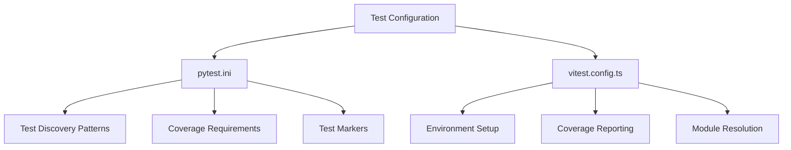
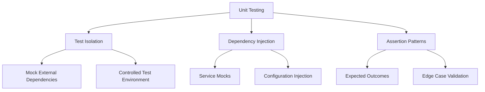
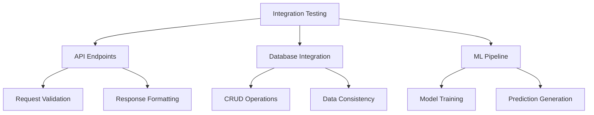
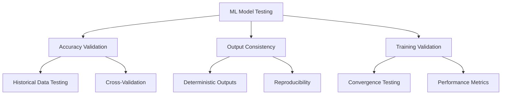
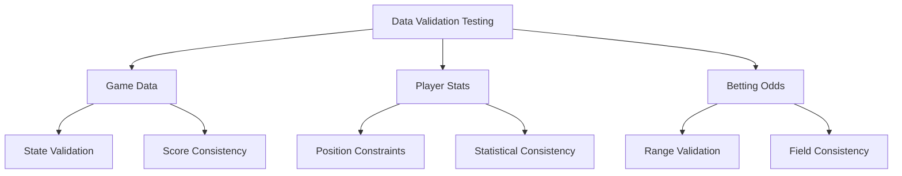
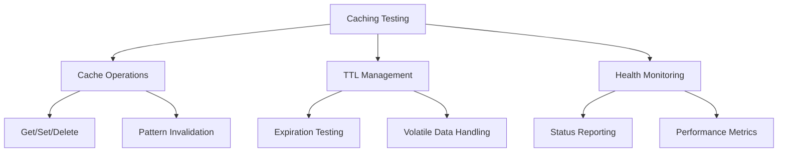
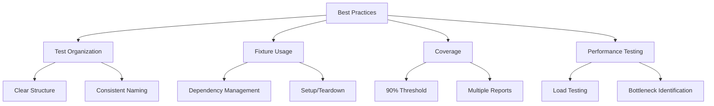
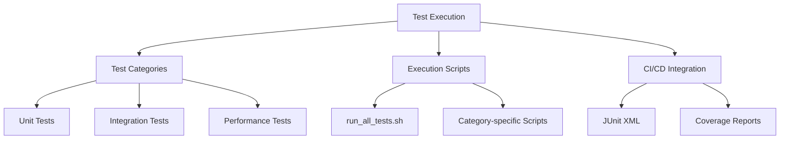

# Unit and Integration Testing

<cite>
**Referenced Files in This Document**   
- [pytest.ini](file://pytest.ini)
- [vitest.config.ts](file://vitest.config.ts)
- [real_data_prediction_service.py](file://src/ml/real_data_prediction_service.py)
- [ensemble_predictor.py](file://src/ml/ensemble_predictor.py)
- [data_validator.py](file://src/validation/data_validator.py)
- [cache_manager.py](file://src/cache/cache_manager.py)
- [cache_manager.py](file://src/analytics/cache_manager.py)
</cite>

## Table of Contents
1. [Introduction](#introduction)
2. [Test Framework Configuration](#test-framework-configuration)
3. [Core Testing Components](#core-testing-components)
4. [Unit Testing Strategies](#unit-testing-strategies)
5. [Integration Testing Approaches](#integration-testing-approaches)
6. [ML Model Testing](#ml-model-testing)
7. [Data Validation Testing](#data-validation-testing)
8. [Caching Mechanism Testing](#caching-mechanism-testing)
9. [Best Practices](#best-practices)
10. [Test Organization and Execution](#test-organization-and-execution)

## Introduction
The NFL Predictor API employs a comprehensive testing strategy that combines pytest for backend logic validation and Vitest for frontend component verification. This documentation details the testing architecture, covering unit and integration testing methodologies for critical components including prediction services, data validators, and caching mechanisms. The testing framework ensures reliability and accuracy across the machine learning pipeline, from data ingestion to prediction generation.

## Test Framework Configuration

The testing infrastructure is configured through two primary configuration files that define the behavior for both backend and frontend testing environments. The pytest configuration establishes comprehensive test discovery patterns, coverage requirements, and marker-based test categorization, while the Vitest configuration sets up the frontend testing environment with proper module resolution and coverage reporting.

**Diagram sources**
- [pytest.ini](file://pytest.ini)
- [vitest.config.ts](file://vitest.config.ts)

**Section sources**
- [pytest.ini](file://pytest.ini)
- [vitest.config.ts](file://vitest.config.ts)

## Core Testing Components

The NFL Predictor API testing framework focuses on several core components that are critical to the system's functionality. These include the real data prediction service, ensemble predictor, data validation layer, and caching mechanisms. Each component has specific testing requirements due to its role in the prediction pipeline and its interaction with external systems and data sources.

### Real Data Prediction Service
The RealDataNFLPredictionService integrates real-time NFL data from SportsData.io with the prediction system, enhancing accuracy through real-world data validation. Testing this component requires mocking external API calls and validating the integration of real data with machine learning predictions.

### Ensemble Predictor
The AdvancedEnsemblePredictor combines multiple specialized models including XGBoost, Random Forest, and LSTM networks to achieve high prediction accuracy. Testing this component involves validating model training, prediction generation, and confidence calibration across various game scenarios.

### Data Validation Layer
The DataValidator ensures data integrity and consistency across all data sources, implementing comprehensive validation for game states, player statistics, and betting odds. Testing focuses on validation rules, sanitization procedures, and error handling for malformed data.

### Caching Mechanisms
The system employs multiple cache managers with Redis integration and in-memory fallback strategies. Testing covers cache operations, TTL management, health monitoring, and performance under various load conditions.

**Section sources**
- [real_data_prediction_service.py](file://src/ml/real_data_prediction_service.py)
- [ensemble_predictor.py](file://src/ml/ensemble_predictor.py)
- [data_validator.py](file://src/validation/data_validator.py)
- [cache_manager.py](file://src/cache/cache_manager.py)
- [cache_manager.py](file://src/analytics/cache_manager.py)

## Unit Testing Strategies

Unit testing in the NFL Predictor API follows best practices for test isolation, dependency injection, and assertion patterns. The framework leverages pytest fixtures to manage test dependencies and ensure consistent test environments across different test suites.

### Test Isolation
Each unit test is designed to test a single component in isolation, with external dependencies mocked using pytest fixtures. This approach ensures that tests are reliable and not affected by external factors such as network connectivity or database state.

### Dependency Injection
The testing framework uses dependency injection to provide test doubles for external services. This allows for comprehensive testing of components that interact with external APIs, databases, and caching systems without requiring actual connections.

### Assertion Patterns
The unit tests employ clear and specific assertion patterns to validate component behavior. Assertions cover both expected outcomes and edge cases, ensuring comprehensive test coverage.

**Diagram sources**
- [conftest.py](file://tests/conftest.py)
- [pytest.ini](file://pytest.ini)

**Section sources**
- [conftest.py](file://tests/conftest.py)
- [pytest.ini](file://pytest.ini)

## Integration Testing Approaches

Integration testing in the NFL Predictor API validates the interactions between components and systems, ensuring that the complete prediction pipeline functions correctly. These tests cover API endpoints, database interactions, and the integration of machine learning models with data processing pipelines.

### API Endpoint Testing
Integration tests for API endpoints validate request handling, response formatting, and error conditions. These tests ensure that the API correctly processes requests and returns appropriate responses based on the underlying business logic.

### Database Integration
Database integration tests verify that data is correctly stored, retrieved, and updated. These tests cover CRUD operations, query performance, and data consistency across related tables.

### Machine Learning Pipeline Integration
Integration tests for the machine learning pipeline validate the complete flow from data ingestion to prediction generation. These tests ensure that models are properly trained, predictions are generated correctly, and results are stored appropriately.

**Diagram sources**
- [real_data_prediction_service.py](file://src/ml/real_data_prediction_service.py)
- [ensemble_predictor.py](file://src/ml/ensemble_predictor.py)

**Section sources**
- [real_data_prediction_service.py](file://src/ml/real_data_prediction_service.py)
- [ensemble_predictor.py](file://src/ml/ensemble_predictor.py)

## ML Model Testing

Testing machine learning components presents unique challenges related to accuracy validation, model output consistency, and performance evaluation. The NFL Predictor API employs specialized testing strategies to address these challenges and ensure reliable model behavior.

### Accuracy Validation
ML model testing includes comprehensive accuracy validation using historical data and cross-validation techniques. Tests measure prediction accuracy against known outcomes and evaluate model performance across different game scenarios.

### Output Consistency
Tests ensure that model outputs are consistent and reproducible across multiple runs. This includes validating that predictions are deterministic when using the same input data and random seed.

### Model Training Validation
The testing framework includes validation of the model training process, ensuring that models converge properly and achieve expected performance metrics on training and validation datasets.

**Diagram sources**
- [ensemble_predictor.py](file://src/ml/ensemble_predictor.py)
- [real_data_prediction_service.py](file://src/ml/real_data_prediction_service.py)

**Section sources**
- [ensemble_predictor.py](file://src/ml/ensemble_predictor.py)
- [real_data_prediction_service.py](file://src/ml/real_data_prediction_service.py)

## Data Validation Testing

The data validation layer is critical to ensuring data integrity throughout the NFL Predictor API. Testing this component involves validating the correctness of validation rules, sanitization procedures, and error handling for various data types.

### Game Data Validation
Tests for game data validation ensure that game states, scores, and timing information meet expected formats and constraints. This includes validating quarter formats, time remaining, and score consistency.

### Player Statistics Validation
Player statistics validation tests verify that player data meets expected ranges and formats. Tests cover position-specific constraints and statistical consistency across different performance metrics.

### Betting Odds Validation
Betting odds validation tests ensure that odds data is within reasonable ranges and that related fields are consistent with each other. This includes validating point spreads, moneylines, and game totals.

**Diagram sources**
- [data_validator.py](file://src/validation/data_validator.py)

**Section sources**
- [data_validator.py](file://src/validation/data_validator.py)

## Caching Mechanism Testing

The caching mechanisms in the NFL Predictor API are designed to improve performance and reduce load on external services. Testing these components ensures that caching behavior is correct, efficient, and resilient to failures.

### Cache Operations
Tests validate the core cache operations including get, set, delete, and invalidate pattern. These tests ensure that data is correctly stored and retrieved from both Redis and in-memory caches.

### TTL Management
Testing covers TTL (Time To Live) management, ensuring that cache entries expire correctly and that TTL values are appropriate for different data volatility levels.

### Health Monitoring
The cache health monitoring system is tested to ensure that it accurately reports cache status and performance metrics. Tests validate both healthy and degraded states.

**Diagram sources**
- [cache_manager.py](file://src/cache/cache_manager.py)
- [cache_manager.py](file://src/analytics/cache_manager.py)

**Section sources**
- [cache_manager.py](file://src/cache/cache_manager.py)
- [cache_manager.py](file://src/analytics/cache_manager.py)

## Best Practices

The NFL Predictor API testing framework follows several best practices to ensure high-quality, maintainable tests that provide reliable validation of system behavior.

### Test Organization
Tests are organized by component and test type, with clear directory structure and naming conventions. This organization makes it easy to locate relevant tests and understand their purpose.

### Fixture Usage
The framework extensively uses pytest fixtures to manage test dependencies and setup/teardown operations. This reduces code duplication and ensures consistent test environments.

### Coverage Requirements
The testing configuration enforces a 90% coverage threshold, ensuring that critical code paths are thoroughly tested. Coverage reports are generated in multiple formats for analysis and CI/CD integration.

### Performance Testing
In addition to functional testing, the framework includes performance tests that validate system behavior under load. These tests help identify bottlenecks and ensure that the system meets performance requirements.

**Diagram sources**
- [pytest.ini](file://pytest.ini)
- [conftest.py](file://tests/conftest.py)

**Section sources**
- [pytest.ini](file://pytest.ini)
- [conftest.py](file://tests/conftest.py)

## Test Organization and Execution

The NFL Predictor API provides a comprehensive test organization structure that supports both individual test execution and complete test suite runs. The framework is designed to be flexible, allowing developers to run specific test categories or the complete test suite based on their needs.

### Test Categories
Tests are categorized using pytest markers that indicate the type of test and its requirements. This allows for selective test execution based on specific criteria such as unit, integration, or performance tests.

### Execution Scripts
The system includes scripts for running different test suites, making it easy to execute specific categories of tests or the complete test suite. These scripts support various options for controlling test execution and output.

### Continuous Integration
The testing framework is designed to integrate with CI/CD pipelines, providing JUnit XML output for test results and coverage reports in multiple formats for analysis.

**Diagram sources**
- [pytest.ini](file://pytest.ini)
- [TEST_SUITE_SUMMARY.md](file://tests/TEST_SUITE_SUMMARY.md)

**Section sources**
- [pytest.ini](file://pytest.ini)
- [TEST_SUITE_SUMMARY.md](file://tests/TEST_SUITE_SUMMARY.md)