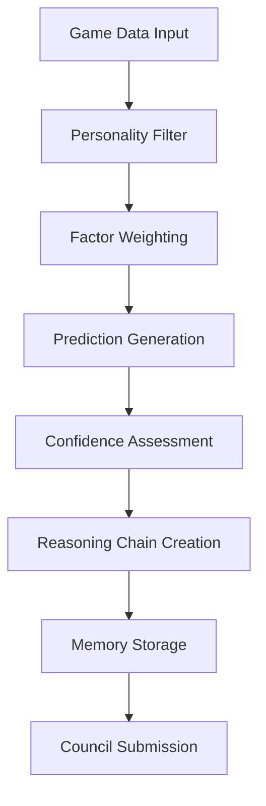
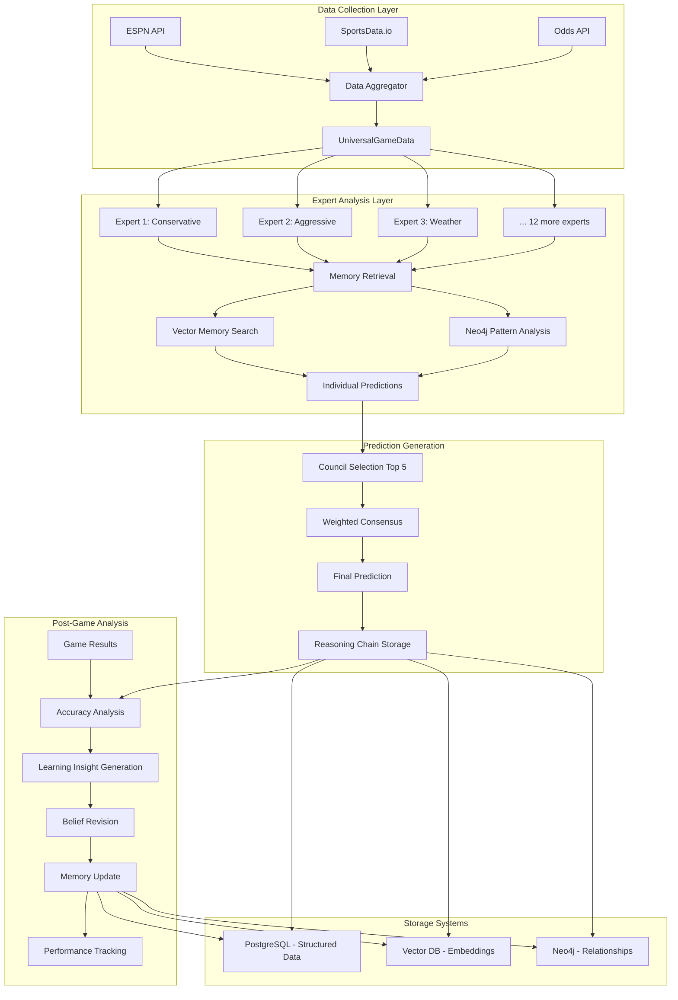

# NFL Prediction System - Complete Workflow Documentation

## Table of Contents
1. [System Overview](#system-overview)
2. [Expert and Team Data Management](#expert-and-team-data-management)
3. [Pre-Game Prediction System](#pre-game-prediction-system)
4. [Post-Game Analysis Sy#post-game-analysis-system)
5. [Storage Architecture](#storage-architecture)
6. [System Integration Flow](#system-integration-flow)

---

## System Overview

The NFL Prediction System is a comprehensive AI-driven platform that leverages multiple expert models, advanced memory systems, and sophisticated data analysis to generate accurate NFL game predictions. The system operates through a continuous cycle of data collection, prediction generation, outcome analysis, and learning refinement.

### Core Components
- **15 AI Expert Models** with unique personalities and analytical approaches
- **Multi-Dimensional Vector Memory System** for pattern recognition
- **Neo4j Graph Database** for relationship analysis
- **Automated Learning Pipeline** for continuous improvement
- **Real-Time Data Integration** from multiple sources

---

## Expert and Team Data Management

### Expert Model Architecture

#### 1. Expert Personalities and Roles

Each of the 15 expert models has a distinct analytical personality and specialization:

| Expert ID | Name | Personality | Primary Focus | Risk Tolerance |
|-----------|------|-------------|---------------|----------------|
| conservative_analyzer | The Conservative | Risk-averse, statistical | Historical patterns, safe bets | Low |
| aggressive_gambler | The Risk Taker | High-risk, high-reward | Contrarian plays, upsets | High |
| weather_specialist | The Meteorologist | Weather-focused | Environmental impact analysis | Medium |
| injury_tracker | The Medical Analyst | Injury-impact focused | Player health, depth charts | Medium |
| market_reader | The Sharp Bettor | Market-driven | Line movements, public sentiment | Medium-High |
| statistical_purist | The Quant | Pure numbers | Advanced metrics, algorithms | Low |
| contrarian_expert | The Fade Master | Anti-public | Contrarian value, public fades | High |
| home_field_guru | The Venue Expert | Location-focused | Home advantages, travel factors | Medium |
| divisional_specialist | The Rivalry Expert | Division-focused | Divisional matchups, familiarity | Medium |
| primetime_analyst | The Spotlight Expert | Game-time focused | Primetime performance patterns | Medium |
| coaching_evaluator | The Strategy Expert | Coaching-focused | Game planning, adjustments | Medium |
| momentum_tracker | The Trend Follower | Streak-focused | Hot/cold streaks, momentum | Medium-High |
| underdog_hunter | The Value Seeker | Underdog-focused | Value betting, dog scenarios | High |
| total_predictor | The Over/Under Expert | Scoring-focused | Total points, pace analysis | Medium |
| situational_expert | The Context Master | Situation-focused | Must-win games, motivation | Medium |

#### 2. Expert Data Contribution Process

**Individual Expert Workflow:**


**Data Collection Methodology per Expert:**
1. **Data Ingestion**: Each expert receives identical UniversalGameData
2. **Personality Processing**: Data filtered through personality-specific lens
3. **Factor Analysis**: 30+ game factors weighted by expert's specialization
4. **Prediction Formulation**: Generate predictions with confidence levels
5. **Reasoning Documentation**: Create detailed reasoning chains
6. **Memory Integration**: Store predictions and reasoning in vector memory

### Team Data Management

#### 1. Team Data Collection Specifications

**Primary Data Sources:**
- **ESPN API**: Real-time scores, schedules, basic stats
- **SportsData.io**: Advanced metrics, player stats, injury reports
- **Odds API**: Betting lines, line movements, public betting percentages
- **Weather API**: Game-time weather conditions
- **News API**: Breaking news, injury updates, roster changes

**Data Collection Frequency:**
- **Real-time**: Scores, injury reports, breaking news
- **Daily**: Updated stats, line movements, weather forecasts
- **Weekly**: Advanced metrics, season trends, coaching updates

#### 2. Team Data Structure

```json
{
  "team_id": "KC",
  "season": 2024,
  "week": 12,
  "basic_stats": {
    "offensive_yards_per_game": 385.2,
    "defensive_yards_allowed": 310.8,
    "points_per_game": 28.4,
    "points_allowed": 19.1,
    "turnover_differential": 8,
    "red_zone_efficiency": 0.642
  },
  "advanced_metrics": {
    "dvoa_offense": 15.2,
    "dvoa_defense": -8.7,
    "epa_per_play": 0.18,
    "success_rate": 0.487,
    "pressure_rate": 0.234
  },
  "situational_stats": {
    "home_record": "6-1",
    "away_record": "4-3",
    "divisional_record": "3-1",
    "vs_winning_teams": "4-2",
    "in_primetime": "2-1"
  },
  "injury_report": [
    {
      "player": "Travis Kelce",
      "position": "TE",
      "injury": "Ankle",
      "status": "Questionable",
      "probability_play": 0.7
    }
  ],
  "recent_performance": {
    "last_3_games": {
      "avg_points": 31.3,
      "avg_yards": 412.7,
      "record": "2-1"
    }
  }
}
```

---

## Pre-Game Prediction System

### 1. Data Retrieval Mechanism

#### Upcoming Matchup Detection
```python
class GameScheduleMonitor:
    def detect_upcoming_games(self, lookhead_days=7):
        """Detect games in the next 7 days requiring predictions"""
        upcoming_games = self.get_schedule(days_ahead=lookhead_days)
        for game in upcoming_games:
            if not self.has_predictions(game.id):
                self.trigger_prediction_workflow(game)
```

#### Data Aggregation Process
1. **Game Context Assembly**: Combine team data, weather, injuries, betting lines
2. **Historical Context Retrieval**: Pull relevant historical matchups and patterns
3. **Market Data Integration**: Current lines, movement, public betting percentages
4. **Expert Memory Activation**: Retrieve relevant memories for each expert

### 2. Vector Storage Implementation

#### Multi-Dimensional Memory Retrieval
```python
class PredictionMemoryRetrieval:
    async def get_relevant_memories(self, game_context, expert_id):
        """Retrieve memories across all embedding dimensions"""

        # Reasoning pattern similarity
        reasoning_memories = await self.vector_service.find_similar_reasoning_memories(
            expert_id=expert_id,
            query_game_data=game_context,
            embedding_type="reasoning",
            max_results=5
        )

        # Contextual situation similarity
        contextual_memories = await self.vector_service.find_similar_reasoning_memories(
            expert_id=expert_id,
            query_game_data=game_context,
            embedding_type="contextual",
            max_results=3
        )

        # Market pattern similarity
        market_memories = await self.vector_service.find_similar_reasoning_memories(
            expert_id=expert_id,
            query_game_data=game_context,
            embedding_type="market",
            max_results=3
        )

        return {
            'reasoning': reasoning_memories,
            'contextual': contextual_memories,
            'market': market_memories
        }
```

### 3. Neo4j Graph Database Utilization

#### Relationship Analysis Architecture
```cypher
// Team relationship nodes
CREATE (team:Team {id: 'KC', name: 'Kansas City Chiefs'})
CREATE (opponent:Team {id: 'DEN', name: 'Denver Broncos'})

// Game relationship with context
CREATE (game:Game {
  id: '2024_12_KC_DEN',
  date: '2024-12-15',
  week: 12,
  season: 2024
})

// Expert prediction relationships
CREATE (expert:Expert {id: 'conservative_analyzer'})
CREATE (prediction:Prediction {
  winner: 'KC',
  margin: 6,
  confidence: 0.75,
  reasoning_type: 'weather_based'
})

// Relationship patterns
CREATE (team)-[:PLAYS_AT_HOME]->(game)
CREATE (opponent)-[:PLAYS_AWAY]->(game)
CREATE (expert)-[:PREDICTS]->(prediction)
CREATE (prediction)-[:FOR_GAME]->(game)

// Historical pattern queries
MATCH (t1:Team)-[:PLAYS_AT_HOME]-(g:Game)-[:PLAYS_AWAY]-(t2:Team)
WHERE t1.id = 'KC' AND t2.id = 'DEN'
AND g.season >= 2020
RETURN g, COUNT(*) as games_played
```

#### Graph-Based Pattern Discovery
1. **Head-to-Head Analysis**: Historical matchup patterns and trends
2. **Expert Performance Tracking**: Success rates by expert and game type
3. **Situational Pattern Recognition**: Weather, injury, and market correlations
4. **Coaching Matchup Analysis**: Coach vs coach historical performance

### 4. Prediction Algorithm Workflow

#### Enhanced Prediction Pipeline
```python
class EnhancedPredictionPipeline:
    async def generate_predictions(self, game_data):
        """Complete prediction generation workflow"""

        # Step 1: Expert Memory Retrieval
        expert_memories = {}
        for expert in self.experts:
            memories = await self.get_relevant_memories(game_data, expert.id)
            expert_memories[expert.id] = memories

        # Step 2: Individual Expert Predictions
        expert_predictions = {}
        for expert in self.experts:
            prediction = await expert.make_memory_enhanced_prediction(
                game_data=game_data,
                relevant_memories=expert_memories[expert.id]
            )
            expert_predictions[expert.id] = prediction

        # Step 3: Council Selection (Top 5 by Composite Score)
        council_experts = self.select_council(expert_predictions)

        # Step 4: Weighted Council Prediction
        final_prediction = self.generate_council_prediction(
            council_experts, expert_predictions
        )

        # Step 5: Store Predictions and Reasoning
        await self.store_prediction_memories(
            game_data, expert_predictions, final_prediction
        )

        return final_prediction
```

#### Decision Logic Framework
1. **Individual Analysis**: Each expert processes game data through personality lens
2. **Memory Integration**: Relevant historical patterns inform current analysis
3. **Confidence Calibration**: Experts adjust confidence based on similar past scenarios
4. **Reasoning Chain Generation**: Detailed explanation of prediction logic
5. **Council Aggregation**: Top 5 experts form weighted consensus
6. **Final Prediction**: Composite prediction with confidence intervals

---

## Post-Game Analysis System

### 1. Result Verification Process

#### Automated Result Collection
```python
class GameResultProcessor:
    async def process_completed_games(self):
        """Process all completed games for analysis"""

        completed_games = await self.get_completed_games()

        for game in completed_games:
            # Get actual results
            actual_result = await self.fetch_game_result(game.id)

            # Get all predictions for this game
            predictions = await self.get_game_predictions(game.id)

            # Process each expert's accuracy
            for expert_id, prediction in predictions.items():
                await self.analyze_prediction_accuracy(
                    expert_id, prediction, actual_result
                )

            # Update expert performance metrics
            await self.update_expert_metrics(game.id, predictions, actual_result)

            # Store learning memories
            await self.store_outcome_memories(game.id, predictions, actual_result)
```

### 2. Error Analysis Methodology

#### Prediction Accuracy Assessment
```python
class PredictionAccuracyAnalyzer:
    def analyze_prediction_accuracy(self, prediction, actual_result):
        """Comprehensive accuracy analysis"""

        accuracy_metrics = {
            'winner_correct': prediction.winner == actual_result.winner,
            'margin_error': abs(prediction.margin - actual_result.margin),
            'confidence_calibration': self.assess_confidence_calibration(
                prediction.confidence, prediction.winner == actual_result.winner
            ),
            'reasoning_validation': self.validate_reasoning_factors(
                prediction.reasoning_chain, actual_result
            )
        }

        # Categorize prediction quality
        if accuracy_metrics['winner_correct']:
            if accuracy_metrics['margin_error'] <= 3:
                accuracy_metrics['quality'] = 'excellent'
            elif accuracy_metrics['margin_error'] <= 7:
                accuracy_metrics['quality'] = 'good'
            else:
                accuracy_metrics['quality'] = 'winner_only'
        else:
            accuracy_metrics['quality'] = 'incorrect'

        return accuracy_metrics
```

#### Learning Insight Generation
```python
class LearningInsightGenerator:
    def generate_learning_insights(self, prediction, actual_result, game_context):
        """Generate specific learning insights from prediction outcomes"""

        insights = []

        # Weather-related learning
        if 'weather_advantage' in prediction.key_factors:
            weather = game_context.weather
            if prediction.winner == actual_result.winner:
                insights.append(f"Weather analysis was crucial - {weather.conditions} conditions played out as expected")
            else:
                insights.append(f"Weather impact was overestimated - {weather.conditions} didn't affect game as predicted")

        # Injury impact learning
        if 'injury_impact' in prediction.key_factors:
            if prediction.winner != actual_result.winner:
                insights.append("Injury impact assessment needs refinement - may have over/underweighted player absence")

        # Market analysis learning
        if 'contrarian_value' in prediction.key_factors:
            line_movement = game_context.line_movement
            if prediction.winner == actual_result.winner:
                insights.append("Contrarian market read was correct - public was wrong as expected")
            else:
                insights.append("Public was right this time - need more selective contrarian approach")

        return insights
```

### 3. Success Evaluation Framework

#### Performance Metrics Calculation
```python
class ExpertPerformanceTracker:
    def calculate_expert_metrics(self, expert_id, time_period='season'):
        """Calculate comprehensive performance metrics"""

        predictions = self.get_expert_predictions(expert_id, time_period)

        metrics = {
            'total_predictions': len(predictions),
            'winner_accuracy': sum(p.winner_correct for p in predictions) / len(predictions),
            'average_margin_error': np.mean([p.margin_error for p in predictions]),
            'confidence_calibration': self.calculate_calibration_score(predictions),
            'roi': self.calculate_betting_roi(predictions),
            'current_bankroll': self.get_current_bankroll(expert_id),
            'streak': self.calculate_current_streak(predictions),
            'best_categories': self.identify_strength_categories(predictions),
            'improvement_areas': self.identify_weakness_categories(predictions)
        }

        return metrics
```

### 4. Model Update Protocol

#### Belief Revision System
```python
class BeliefRevisionEngine:
    async def process_belief_updates(self, expert_id, prediction_outcome):
        """Update expert beliefs based on prediction outcomes"""

        # Identify which beliefs need updating
        belief_updates = []

        if prediction_outcome.quality == 'incorrect':
            # Analyze what went wrong
            failed_factors = self.identify_failed_reasoning_factors(
                prediction_outcome.prediction.reasoning_chain,
                prediction_outcome.actual_result
            )

            for factor in failed_factors:
                belief_updates.append({
                    'factor': factor,
                    'adjustment': 'decrease_weight',
                    'magnitude': 0.1,
                    'reason': f'Factor failed in {prediction_outcome.game_id}'
                })

        elif prediction_outcome.quality == 'excellent':
            # Reinforce successful reasoning
            successful_factors = self.identify_successful_reasoning_factors(
                prediction_outcome.prediction.reasoning_chain
            )

            for factor in successful_factors:
                belief_updates.append({
                    'factor': factor,
                    'adjustment': 'increase_weight',
                    'magnitude': 0.05,
                    'reason': f'Factor was key to success in {prediction_outcome.game_id}'
                })

        # Apply belief updates
        await self.apply_belief_updates(expert_id, belief_updates)

        # Store learning memory
        await self.store_belief_revision_memory(expert_id, belief_updates, prediction_outcome)
```

---

## Storage Architecture

### 1. Individual Team Data Storage

#### Team Knowledge Database Schema
```sql
-- Core team data storage
CREATE TABLE team_knowledge (
    team_id VARCHAR(3) PRIMARY KEY,
    season INTEGER NOT NULL,
    week INTEGER NOT NULL,

    -- Performance metrics
    offensive_stats JSONB NOT NULL,
    defensive_stats JSONB NOT NULL,
    special_teams_stats JSONB NOT NULL,

    -- Situational performance
    home_performance JSONB,
    away_performance JSONB,
    divisional_performance JSONB,
    weather_performance JSONB,

    -- Injury and roster data
    current_injuries JSONB,
    depth_chart JSONB,
    recent_transactions JSONB,

    -- Coaching and strategy
    coaching_tendencies JSONB,
    play_calling_patterns JSONB,

    -- Confidence scores for patterns
    pattern_confidence_scores JSONB,

    -- Metadata
    last_updated TIMESTAMP DEFAULT NOW(),
    data_sources JSONB
);

-- Team performance trends
CREATE TABLE team_performance_trends (
    id UUID DEFAULT gen_random_uuid() PRIMARY KEY,
    team_id VARCHAR(3) NOT NULL,
    season INTEGER NOT NULL,
    trend_type VARCHAR(50) NOT NULL, -- 'offensive', 'defensive', 'situational'
    trend_data JSONB NOT NULL,
    confidence_score DECIMAL(3,2),
    created_at TIMESTAMP DEFAULT NOW()
);
```

### 2. Head-to-Head Matchup Memory

#### Matchup Memory Schema
```sql
-- Historical matchup data
CREATE TABLE matchup_memories (
    matchup_id VARCHAR(10) NOT NULL, -- "KC_vs_DEN"
    game_date DATE NOT NULL,
    season INTEGER NOT NULL,
    week INTEGER NOT NULL,

    -- Pre-game context
    pre_game_analysis JSONB NOT NULL,
    betting_context JSONB,
    weather_conditions JSONB,
    injury_context JSONB,

    -- Predictions from all experts
    expert_predictions JSONB NOT NULL,
    council_prediction JSONB NOT NULL,

    -- Actual results
    actual_results JSONB NOT NULL,

    -- Post-game analysis
    accuracy_analysis JSONB NOT NULL,
    learning_insights JSONB,

    -- Performance tracking
    expert_accuracy_scores JSONB,
    council_accuracy_score DECIMAL(5,4),

    PRIMARY KEY (matchup_id, game_date)
);

-- Matchup pattern recognition
CREATE TABLE matchup_patterns (
    id UUID DEFAULT gen_random_uuid() PRIMARY KEY,
    matchup_id VARCHAR(10) NOT NULL,
    pattern_type VARCHAR(50) NOT NULL, -- 'weather', 'injury', 'coaching', 'situational'
    pattern_description TEXT NOT NULL,
    pattern_data JSONB NOT NULL,
    confidence_score DECIMAL(3,2),
    sample_size INTEGER,
    last_validated DATE,
    created_at TIMESTAMP DEFAULT NOW()
);
```

### 3. Expert Memory Architecture

#### Reasoning Memory Storage
```sql
-- Enhanced reasoning memories (as implemented)
CREATE TABLE reasoning_memory_vectors (
    id UUID DEFAULT gen_random_uuid() PRIMARY KEY,
    expert_id TEXT NOT NULL,
    memory_type TEXT NOT NULL,

    -- Game context
    game_id TEXT,
    home_team TEXT NOT NULL,
    away_team TEXT NOT NULL,
    week INTEGER,
    season INTEGER,

    -- Rich reasoning content
    reasoning_content TEXT NOT NULL,      -- Pre-game reasoning chain
    outcome_analysis TEXT NOT NULL,       -- Post-game learning reflection
    contextual_factors TEXT NOT NULL,     -- Environmental factors
    market_dynamics TEXT NOT NULL,        -- Market dynamics

    -- Vector embeddings for similarity search
    reasoning_embedding vector(1536),     -- Reasoning pattern similarity
    learning_embedding vector(1536),      -- Learning outcome similarity
    contextual_embedding vector(1536),    -- Situational similarity
    market_embedding vector(1536),        -- Market pattern similarity

    -- Structured metadata
    metadata JSONB DEFAULT '{}',

    created_at TIMESTAMP DEFAULT NOW(),
    updated_at TIMESTAMP DEFAULT NOW()
);

-- Expert performance tracking
CREATE TABLE expert_performance_history (
    id UUID DEFAULT gen_random_uuid() PRIMARY KEY,
    expert_id TEXT NOT NULL,
    game_id TEXT NOT NULL,
    prediction_data JSONB NOT NULL,
    actual_result JSONB NOT NULL,
    accuracy_metrics JSONB NOT NULL,
    bankroll_change DECIMAL(10,2),
    current_bankroll DECIMAL(10,2),
    performance_rank INTEGER,
    created_at TIMESTAMP DEFAULT NOW()
);
```

### 4. Version Control and Historical Tracking

#### Data Versioning System
```sql
-- Data version control
CREATE TABLE data_versions (
    id UUID DEFAULT gen_random_uuid() PRIMARY KEY,
    table_name VARCHAR(100) NOT NULL,
    record_id TEXT NOT NULL,
    version_number INTEGER NOT NULL,
    change_type VARCHAR(20) NOT NULL, -- 'insert', 'update', 'delete'
    old_data JSONB,
    new_data JSONB,
    changed_by VARCHAR(100),
    change_reason TEXT,
    created_at TIMESTAMP DEFAULT NOW()
);

-- System state snapshots
CREATE TABLE system_snapshots (
    id UUID DEFAULT gen_random_uuid() PRIMARY KEY,
    snapshot_date DATE NOT NULL,
    season INTEGER NOT NULL,
    week INTEGER NOT NULL,

    -- Expert states
    expert_rankings JSONB NOT NULL,
    expert_bankrolls JSONB NOT NULL,
    council_composition JSONB NOT NULL,

    -- System metrics
    overall_accuracy DECIMAL(5,4),
    total_predictions INTEGER,
    system_confidence DECIMAL(3,2),

    -- Performance trends
    accuracy_trend JSONB,
    learning_velocity JSONB,

    created_at TIMESTAMP DEFAULT NOW()
);
```

---

## System Integration Flow

### Complete Workflow Diagram



### Integration Points and Data Flow

#### 1. Real-Time Data Pipeline
- **Frequency**: Every 15 minutes during game days
- **Sources**: ESPN, SportsData.io, Odds API, Weather API
- **Processing**: Data validation, normalization, enrichment
- **Storage**: Immediate persistence with version control

#### 2. Prediction Generation Pipeline
- **Trigger**: 48 hours before game time
- **Process**: Data aggregation → Expert analysis → Memory retrieval → Prediction generation
- **Output**: Individual expert predictions + Council consensus
- **Storage**: Predictions, reasoning chains, confidence scores

#### 3. Post-Game Analysis Pipeline
- **Trigger**: Game completion + 2 hours (for final stats)
- **Process**: Result collection → Accuracy analysis → Learning generation → Memory updates
- **Output**: Performance metrics, learning insights, belief revisions
- **Storage**: Updated expert models, enhanced memories, performance history

#### 4. Continuous Learning Loop
- **Daily**: Performance metric updates, trend analysis
- **Weekly**: Expert ranking recalculation, council recomposition
- **Monthly**: System-wide performance review, model optimization
- **Seasonally**: Comprehensive system evaluation, architecture improvements

### Performance Monitoring and Alerting

#### Key Performance Indicators (KPIs)
- **Prediction Accuracy**: Overall system accuracy vs. baseline models
- **Expert Performance**: Individual expert accuracy and ROI tracking
- **Learning Velocity**: Rate of improvement over time
- **System Reliability**: Uptime, data freshness, prediction generation success rate
- **Memory Effectiveness**: Relevance and utility of retrieved memories

#### Automated Monitoring
```python
class SystemHealthMonitor:
    def monitor_system_health(self):
        """Continuous system health monitoring"""

        health_metrics = {
            'data_freshness': self.check_data_freshness(),
            'expert_performance': self.check_expert_performance(),
            'prediction_accuracy': self.check_recent_accuracy(),
            'memory_system_health': self.check_memory_systems(),
            'database_performance': self.check_database_health()
        }

        # Alert on anomalies
        for metric, value in health_metrics.items():
            if self.is_anomalous(metric, value):
                self.send_alert(metric, value)

        return health_metrics
```

---

## Conclusion

This NFL Prediction System represents a sophisticated integration of AI expertise, advanced memory systems, and comprehensive data analysis. The system's strength lies in its ability to:

1. **Learn Continuously**: Each prediction outcome enhances the system's knowledge
2. **Maintain Diversity**: 15 distinct expert perspectives prevent groupthink
3. **Capture Reasoning**: Rich memory system preserves not just outcomes but thought processes
4. **Adapt Dynamically**: Belief revision ensures experts evolve with changing conditions
5. **Scale Effectively**: Modular architecture supports system growth and enhancement

The combination of structured data storage, vector-based memory retrieval, graph relationship analysis, and continuous learning creates a robust foundation for accurate NFL prediction and ongoing system improvement.
