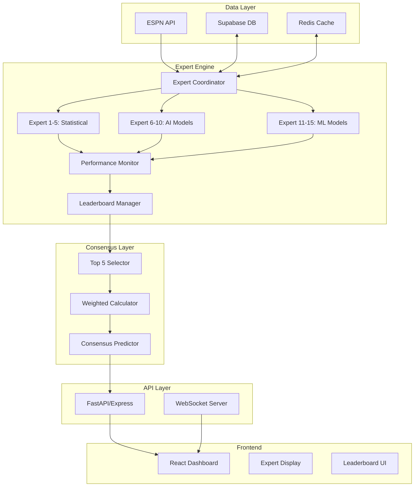

# Expert Competition System - Technical Architecture

## System Overview



---

## Core Architecture Components

### 1. Expert Engine Service
**Location**: `/src/experts/`

```typescript
// src/experts/ExpertEngine.ts
export class ExpertEngine {
  private experts: Map<string, IExpert>;
  private coordinator: ExpertCoordinator;
  private performanceMonitor: PerformanceMonitor;
  private leaderboardManager: LeaderboardManager;

  constructor() {
    this.initializeExperts();
    this.startCompetition();
  }

  async generatePredictions(gameId: string): Promise<ExpertPredictions> {
    // Parallel prediction generation
    const predictions = await Promise.all(
      Array.from(this.experts.values()).map(expert =>
        expert.predict(gameId)
      )
    );

    // Track performance
    await this.performanceMonitor.recordPredictions(predictions);

    // Update leaderboard
    await this.leaderboardManager.update();

    // Get consensus from top 5
    const consensus = await this.calculateConsensus(predictions);

    return { predictions, consensus, leaderboard: this.getLeaderboard() };
  }
}
```

### 2. Expert Interface Design
**Location**: `/src/experts/models/`

```typescript
// src/experts/models/IExpert.ts
export interface IExpert {
  id: string;
  name: string;
  type: 'statistical' | 'ai' | 'ml';
  persona: ExpertPersona;

  // Core methods
  predict(gameData: GameData): Promise<Prediction>;
  explainReasoning(): string;
  adjustStrategy(performance: PerformanceMetrics): void;

  // Competition methods
  reactToLeaderboard(position: number): void;
  learnFromTopPerformers(leaders: IExpert[]): void;

  // State
  confidence: number;
  riskTolerance: number;
  recentAccuracy: number[];
  totalPredictions: number;
  correctPredictions: number;
}

export interface ExpertPersona {
  specialty: string;
  aggressiveness: number; // 0-1
  adaptability: number;   // 0-1
  consistency: number;    // 0-1
  uniqueTraits: string[];
}
```

### 3. Database Schema Extension
**Location**: `/src/database/migrations/`

```sql
-- Expert tables to add to existing Supabase schema

-- Expert registry
CREATE TABLE experts (
    id UUID PRIMARY KEY DEFAULT uuid_generate_v4(),
    expert_id VARCHAR(50) UNIQUE NOT NULL,
    name VARCHAR(100) NOT NULL,
    type VARCHAR(20) CHECK (type IN ('statistical', 'ai', 'ml')),
    specialty VARCHAR(100),
    persona JSONB,
    created_at TIMESTAMP DEFAULT NOW(),
    active BOOLEAN DEFAULT true
);

-- Expert predictions
CREATE TABLE expert_predictions (
    id UUID PRIMARY KEY DEFAULT uuid_generate_v4(),
    expert_id VARCHAR(50) REFERENCES experts(expert_id),
    game_id VARCHAR(100),
    prediction_time TIMESTAMP DEFAULT NOW(),
    predicted_winner VARCHAR(50),
    confidence DECIMAL(5,2),
    spread_prediction DECIMAL(5,1),
    total_prediction DECIMAL(5,1),
    reasoning TEXT,
    metadata JSONB,

    UNIQUE(expert_id, game_id)
);

-- Expert performance
CREATE TABLE expert_performance (
    id UUID PRIMARY KEY DEFAULT uuid_generate_v4(),
    expert_id VARCHAR(50) REFERENCES experts(expert_id),
    week INTEGER,
    season INTEGER,
    predictions_count INTEGER DEFAULT 0,
    correct_count INTEGER DEFAULT 0,
    accuracy DECIMAL(5,2),
    confidence_calibration DECIMAL(5,2),
    average_confidence DECIMAL(5,2),
    points_earned DECIMAL(10,2),
    updated_at TIMESTAMP DEFAULT NOW(),

    UNIQUE(expert_id, week, season)
);

-- Leaderboard snapshots
CREATE TABLE expert_leaderboard (
    id UUID PRIMARY KEY DEFAULT uuid_generate_v4(),
    snapshot_time TIMESTAMP DEFAULT NOW(),
    week INTEGER,
    season INTEGER,
    rank INTEGER,
    expert_id VARCHAR(50) REFERENCES experts(expert_id),
    accuracy DECIMAL(5,2),
    recent_form DECIMAL(5,2),
    total_points DECIMAL(10,2),
    on_board BOOLEAN DEFAULT false,
    consensus_weight DECIMAL(5,2),

    UNIQUE(week, season, rank)
);

-- Create indexes for performance
CREATE INDEX idx_expert_predictions_game ON expert_predictions(game_id);
CREATE INDEX idx_expert_performance_week ON expert_performance(week, season);
CREATE INDEX idx_leaderboard_week ON expert_leaderboard(week, season);
```

### 4. Expert Implementation Classes
**Location**: `/src/experts/implementations/`

```typescript
// src/experts/implementations/StatisticalExperts.ts
export class EloExpert extends BaseExpert {
  constructor() {
    super({
      id: 'elo_prophet',
      name: 'ELO Prophet',
      type: 'statistical',
      persona: {
        specialty: 'power_ratings',
        aggressiveness: 0.3,
        adaptability: 0.5,
        consistency: 0.9,
        uniqueTraits: ['conservative', 'historical_focus', 'slow_adjuster']
      }
    });
  }

  async predict(gameData: GameData): Promise<Prediction> {
    const eloRatings = await this.getEloRatings(gameData);
    const winProbability = this.calculateEloWinProbability(eloRatings);

    // Adjust confidence based on leaderboard position
    const confidence = this.adjustConfidence(winProbability);

    return {
      winner: winProbability > 0.5 ? gameData.homeTeam : gameData.awayTeam,
      confidence,
      spread: this.eloToSpread(winProbability),
      reasoning: this.generateReasoning(eloRatings, winProbability)
    };
  }

  reactToLeaderboard(position: number): void {
    if (position > 5) {
      // Not on board - slightly increase risk
      this.riskTolerance = Math.min(0.4, this.riskTolerance * 1.05);
    } else if (position === 1) {
      // Leading - play it safe
      this.riskTolerance = Math.max(0.2, this.riskTolerance * 0.95);
    }
  }
}
```

### 5. Consensus Calculator
**Location**: `/src/experts/consensus/`

```typescript
// src/experts/consensus/ConsensusBuilder.ts
export class ConsensusBuilder {
  private readonly WEIGHT_DISTRIBUTION = {
    1: 0.30,
    2: 0.25,
    3: 0.20,
    4: 0.15,
    5: 0.10
  };

  async buildConsensus(
    predictions: ExpertPrediction[],
    leaderboard: LeaderboardEntry[]
  ): Promise<ConsensusPrediction> {
    // Get top 5 experts
    const topExperts = leaderboard
      .slice(0, 5)
      .map(entry => ({
        ...entry,
        prediction: predictions.find(p => p.expertId === entry.expertId)
      }))
      .filter(e => e.prediction);

    // Calculate weighted consensus
    let totalWeight = 0;
    let weightedConfidence = 0;
    const teamVotes = new Map<string, number>();

    topExperts.forEach((expert, index) => {
      const weight = this.WEIGHT_DISTRIBUTION[index + 1];
      const prediction = expert.prediction;

      // Accumulate weighted votes
      const currentVotes = teamVotes.get(prediction.winner) || 0;
      teamVotes.set(prediction.winner, currentVotes + weight);

      weightedConfidence += prediction.confidence * weight;
      totalWeight += weight;
    });

    // Determine consensus winner
    const winner = Array.from(teamVotes.entries())
      .sort((a, b) => b[1] - a[1])[0][0];

    return {
      winner,
      confidence: weightedConfidence / totalWeight,
      topExpertPredictions: topExperts,
      votingBreakdown: Object.fromEntries(teamVotes),
      consensusStrength: this.calculateConsensusStrength(teamVotes)
    };
  }
}
```

### 6. Real-time Updates
**Location**: `/src/websocket/`

```typescript
// src/websocket/ExpertWebSocket.ts
export class ExpertWebSocketHandler {
  private io: Server;
  private expertEngine: ExpertEngine;

  setupHandlers() {
    this.io.on('connection', (socket) => {
      // Subscribe to expert updates
      socket.on('subscribe:experts', async () => {
        socket.join('expert-updates');

        // Send initial state
        const currentState = await this.expertEngine.getCurrentState();
        socket.emit('experts:initial', currentState);
      });

      // Real-time prediction updates
      socket.on('game:predict', async (gameId) => {
        const predictions = await this.expertEngine.generatePredictions(gameId);

        // Broadcast to all subscribers
        this.io.to('expert-updates').emit('predictions:new', {
          gameId,
          predictions: predictions.predictions,
          consensus: predictions.consensus,
          leaderboard: predictions.leaderboard,
          timestamp: new Date()
        });
      });
    });
  }

  // Broadcast leaderboard changes
  async broadcastLeaderboardUpdate(changes: LeaderboardChange[]) {
    this.io.to('expert-updates').emit('leaderboard:update', {
      changes,
      newLeaderboard: await this.expertEngine.getLeaderboard(),
      promotions: changes.filter(c => c.type === 'promotion'),
      demotions: changes.filter(c => c.type === 'demotion')
    });
  }
}
```

### 7. Frontend Components
**Location**: `/src/components/experts/`

```jsx
// src/components/experts/ExpertCompetitionDashboard.jsx
import React, { useState, useEffect } from 'react';
import { motion, AnimatePresence } from 'framer-motion';
import { useWebSocket } from '../../hooks/useWebSocket';

export const ExpertCompetitionDashboard = () => {
  const [experts, setExperts] = useState([]);
  const [consensus, setConsensus] = useState(null);
  const [leaderboard, setLeaderboard] = useState([]);
  const { subscribe, on } = useWebSocket();

  useEffect(() => {
    subscribe('experts');

    on('predictions:new', (data) => {
      setExperts(data.predictions);
      setConsensus(data.consensus);
      animateNewPredictions(data.predictions);
    });

    on('leaderboard:update', (data) => {
      animateLeaderboardChanges(data.changes);
      setLeaderboard(data.newLeaderboard);
    });
  }, []);

  return (
    <div className="expert-competition-dashboard">
      <div className="grid grid-cols-12 gap-4">
        {/* Leaderboard Section - Left */}
        <div className="col-span-3">
          <LeaderboardPanel
            leaderboard={leaderboard}
            topFiveOnly={false}
          />
        </div>

        {/* Main Prediction Area - Center */}
        <div className="col-span-6">
          <ConsensusDisplay consensus={consensus} />
          <ExpertPredictionGrid experts={experts} />
        </div>

        {/* Expert Details - Right */}
        <div className="col-span-3">
          <ExpertSpotlight
            expert={getSpotlightExpert(experts)}
          />
        </div>
      </div>
    </div>
  );
};
```

### 8. API Endpoints
**Location**: `/src/api/experts/`

```python
# src/api/experts/routes.py
from fastapi import APIRouter, WebSocket
from typing import List
import asyncio

router = APIRouter(prefix="/api/experts")

@router.get("/")
async def get_all_experts():
    """Get all 15 expert profiles"""
    return await expert_engine.get_all_experts()

@router.get("/leaderboard")
async def get_leaderboard(week: int = None):
    """Get current expert leaderboard"""
    return await leaderboard_manager.get_current(week)

@router.get("/predictions/{game_id}")
async def get_game_predictions(game_id: str):
    """Get all expert predictions for a game"""
    predictions = await expert_engine.get_predictions(game_id)
    consensus = await consensus_builder.build(predictions)
    return {
        "predictions": predictions,
        "consensus": consensus,
        "leaderboard": await leaderboard_manager.get_current()
    }

@router.post("/predict/{game_id}")
async def generate_predictions(game_id: str):
    """Trigger prediction generation for a game"""
    result = await expert_engine.generate_predictions(game_id)

    # Broadcast via WebSocket
    await websocket_manager.broadcast({
        "type": "predictions:new",
        "data": result
    })

    return result

@router.websocket("/ws")
async def expert_websocket(websocket: WebSocket):
    """WebSocket for real-time expert updates"""
    await websocket_manager.connect(websocket)
    try:
        while True:
            await asyncio.sleep(1)
    finally:
        websocket_manager.disconnect(websocket)
```

---

## Integration Points

### 1. With Existing ESPN Service
```javascript
// Modify espnApiService.js
async function fetchGameWithExperts(gameId) {
  const gameData = await fetchGame(gameId);
  const expertPredictions = await expertEngine.generatePredictions(gameId);

  return {
    ...gameData,
    expertPredictions,
    consensus: expertPredictions.consensus
  };
}
```

### 2. With Existing Prediction Service
```python
# Modify prediction_service.py
class MLPredictionService:
    def __init__(self):
        self.expert_engine = ExpertEngine()
        # ... existing code

    def generate_predictions(self, game_id):
        # Get expert predictions
        expert_results = self.expert_engine.generate_predictions(game_id)

        # Existing ML predictions
        ml_predictions = self.existing_predict(game_id)

        # Combine
        return {
            'ml_predictions': ml_predictions,
            'expert_predictions': expert_results['predictions'],
            'consensus': expert_results['consensus'],
            'leaderboard': expert_results['leaderboard']
        }
```

### 3. With Supabase
```javascript
// Add to supabaseClient.js
export const expertTables = {
  experts: 'experts',
  predictions: 'expert_predictions',
  performance: 'expert_performance',
  leaderboard: 'expert_leaderboard'
};

export async function getExpertLeaderboard(week = null) {
  let query = supabase
    .from('expert_leaderboard')
    .select('*')
    .order('rank', { ascending: true });

  if (week) {
    query = query.eq('week', week);
  }

  return await query;
}
```

---

## Deployment Strategy

### Phase 1: Foundation (Day 1-2)
1. Fix PlayerPropsEngine error
2. Setup database schema
3. Create base expert classes
4. Implement 5 statistical experts

### Phase 2: Expert Models (Day 3-4)
1. Implement 5 AI model experts
2. Implement 5 ML model experts
3. Create prediction generation logic
4. Test individual predictions

### Phase 3: Competition (Day 5-6)
1. Build performance tracking
2. Implement leaderboard logic
3. Create consensus calculator
4. Add competitive dynamics

### Phase 4: UI Integration (Day 7-8)
1. Create React components
2. Setup WebSocket connections
3. Add animations
4. Integrate with existing dashboard

### Phase 5: Testing & Launch (Day 9-10)
1. Test with historical data
2. Tune expert parameters
3. Deploy to production
4. Monitor performance

---

## Performance Considerations

### Caching Strategy
```typescript
// Use Redis for real-time data
const cacheKeys = {
  leaderboard: 'experts:leaderboard:current',
  predictions: 'experts:predictions:{gameId}',
  consensus: 'experts:consensus:{gameId}',
  performance: 'experts:performance:{expertId}'
};

// Cache for 5 minutes for predictions
// Cache for 1 hour for leaderboard
```

### Parallel Processing
```typescript
// Generate all expert predictions in parallel
const predictions = await Promise.allSettled(
  experts.map(expert =>
    withTimeout(expert.predict(gameData), 5000)
  )
);
```

### Database Optimization
- Indexed columns for fast queries
- Materialized views for leaderboard
- Batch inserts for predictions
- Connection pooling

---

## Monitoring & Analytics

### Key Metrics
1. **System Health**
   - Expert response times
   - Prediction generation success rate
   - WebSocket connection stability

2. **Competition Metrics**
   - Leaderboard volatility
   - Expert accuracy trends
   - Consensus accuracy vs individual

3. **User Engagement**
   - Expert page views
   - Prediction comparisons
   - Time spent on expert analysis

---

## Security & Rate Limiting

### API Protection
```typescript
// Rate limiting for prediction requests
const rateLimiter = rateLimit({
  windowMs: 60 * 1000, // 1 minute
  max: 10, // 10 requests per minute
  message: 'Too many prediction requests'
});

router.use('/api/experts/predict', rateLimiter);
```

### Data Validation
```typescript
// Validate expert predictions
const validatePrediction = (prediction: any): boolean => {
  return (
    prediction.confidence >= 0 &&
    prediction.confidence <= 100 &&
    ['home', 'away'].includes(prediction.winner) &&
    prediction.reasoning.length <= 500
  );
};
```

---

This architecture provides a complete, production-ready implementation of the 15-expert competition system that integrates seamlessly with your existing NFL Predictor platform!